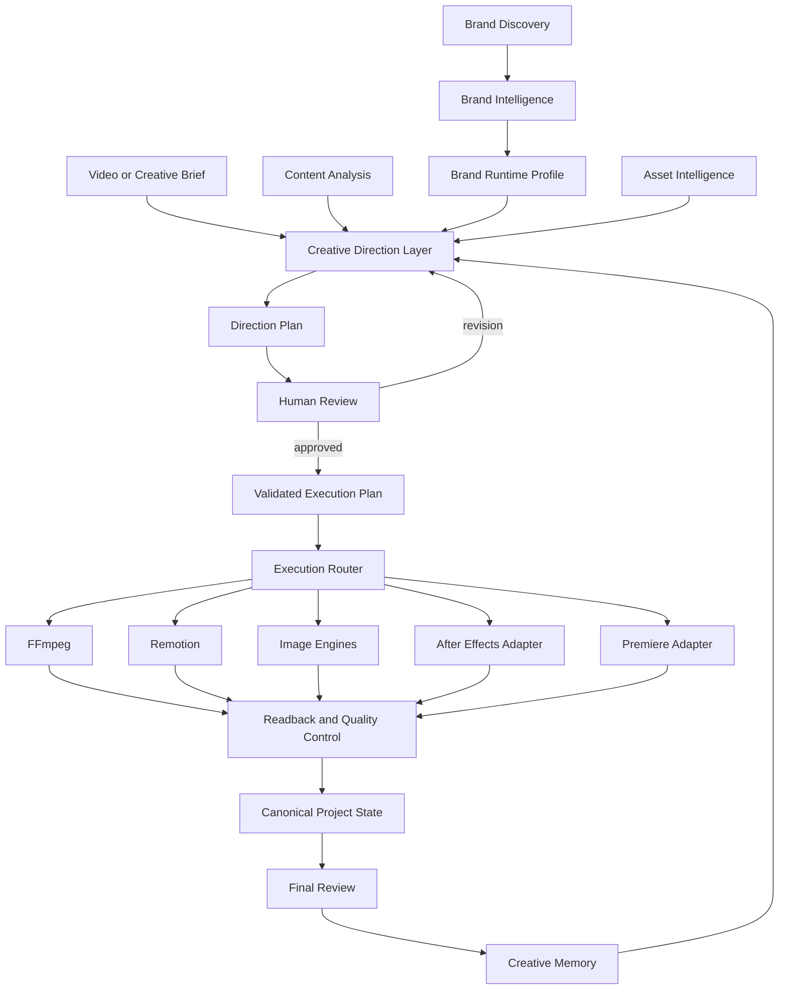

# Arquitetura do Raiz Engine

Status: arquitetura-base para evolução incremental  
Repositório: `daniela-socoloski/raiz-engine`  
Data do levantamento inicial: 2026-08-19  
Escopo inicial de produto: direção audiovisual de marca e execução de vídeo  

## 1. Propósito deste documento

Este documento organiza a evolução do `raiz-engine` a partir dos sistemas que já existem. Ele não propõe apagar o Cena Raiz, reescrever todos os módulos ou criar uma plataforma paralela.

O objetivo é construir uma camada própria capaz de transformar estratégia de marca em decisões criativas estruturadas e, depois, compilar essas decisões para os motores de produção existentes.

Em termos simples:

> O sistema atual já sabe produzir. O Motor Criativo Raiz deve aprender a dirigir antes de mandar produzir.

### Intenção central do projeto

O objetivo principal é construir progressivamente o **Raiz Engine**. Organizar repositórios, preservar proveniência, recuperar o Cena Raiz e migrar nomes são fundações necessárias, mas não representam a chegada.

O plano geral deste documento será a espinha dorsal contínua da construção. Depois da fundação, cada nova ideia será aprimorada e arquitetada dentro do mesmo sistema, em vez de originar mais uma pasta isolada, um prompt sem contrato ou uma ferramenta paralela.

Isso inclui as ideias atuais e futuras de:

- inteligência de marca;
- narrativa e direção audiovisual;
- imagem e fotografia;
- motion e som;
- carrosséis e sistemas editoriais;
- assets reutilizáveis;
- memória criativa;
- recipes especializadas;
- Remotion, FFmpeg, After Effects e Premiere;
- novos modelos, ferramentas e interfaces.

O `Raiz Engine` não será apenas um novo nome para a skill ou para o desktop. Ele será o núcleo próprio que define contratos, preserva inteligência, formula decisões criativas e coordena componentes substituíveis.

O nome do repositório técnico também é `raiz-engine`. `Sistema Marca Raiz` permanece como nome do ecossistema e da família de produtos; `Raiz Engine` identifica o monorepositório e o motor que sustenta essa família.

Este documento é a referência arquitetural inicial. Contratos e decisões confirmados durante a implementação devem ser versionados aqui ou em ADRs, em vez de permanecer apenas em conversas e prompts.

### Documentos relacionados

- [Guia de organização do repositório](GUIA-ORGANIZACAO-REPOSITORIO.md) — primeira leitura operacional. Define como preservar as duas bases herdadas, consolidar o monorepositório e criar o baseline antes de mudar código.
- [Plano de migração de identidade](PLANO-MIGRACAO-IDENTIDADE.md) — nomenclatura, compatibilidade e retirada gradual do legado depois da consolidação estrutural.
- [Política de fonte única funcional](POLITICA-FONTE-UNICA-FUNCIONAL.md) — regra obrigatória para atualizar a implementação canônica e remover arquivos, nomes e duplicatas obsoletos depois da migração validada.
- [Plano de evolução audiovisual do Cena Raiz](docs/architecture/cena-raiz-audiovisual-evolution.md) — blueprint ativo de direção audiovisual, narrativa, motion, assets, timeline, execução, revisão e memória. Adobe é apenas uma das integrações de execução; suas mutações reais por MCP e sincronização são ativadas somente na Fase 7.
- [Cena Raiz Desktop](apps/cena-raiz-desktop/README.md) — estado operacional do aplicativo.
- [Cena Raiz skill](skills/cena-raiz/README.md) — origem do fluxo de edição por agente e dos helpers.
- [Marca Raiz Prisma](marca-raiz-prisma/start-here.md) — entrada atual da inteligência de marca.
- [Raiz Images](raiz-Images/COMECE-AQUI.md) — direção e execução de imagens.
- [Slide Raiz](slide-raiz/00-README.md) — inteligência editorial e narrativa de carrosséis.

## 2. Situação atual verificada

> **HISTORICAL SNAPSHOT — NOT CURRENT OPERATIONAL STATE**
>
> Esta seção registra o levantamento de 2026-08-19. Depois dele, as Etapas 1, 2, 3, 8 e 9
> foram executadas. Para o estado operacional atual, ver
> `docs/provenance/INVENTARIO-REPOSITORIO.md` § 15 e `GUIA-ORGANIZACAO-REPOSITORIO.md` § 4.1.
> Este documento descreve o **destino arquitetural**; configuração temporária desta
> máquina não pertence a ele.

O checkout local já reúne vários sistemas com capacidades valiosas:

| Área | Capacidade atual | Papel futuro |
|---|---|---|
| `marca-raiz-prisma/` | Descoberta, estratégia, voz, audiência, sistema visual, fotografia, anti-patterns e geração do Marca-Raiz | Fonte da `Brand Intelligence` |
| `cena-raiz/cenaraiz/cena-raiz/` | Skill de edição, transcrição, corte, helpers, templates e instalador multiplataforma | Base operacional herdada e referência de execução |
| `cena-raiz/cenaraiz/cena-raiz-desktop/` | Aplicativo Electron, timeline não destrutiva, chat, aprovação, estilos, FFmpeg, WhisperX, Remotion e render | Produto principal e `Production Engine` inicial |
| `raiz-Images/` | Direção fotográfica, direção estilizada, prompts e adapters de geração | `Image Direction` e adapter de geração de imagem |
| `slide-raiz/` | Pesquisa editorial, headlines, narrativa, design system e render de carrosséis | Fonte para `Narrative Intelligence` e composição editorial |
| `SKILLS/ads-produto/` | Receita hero-first, consistência visual, geração de takes e montagem de anúncio | Primeiro `Creative Recipe` especializado |
| `ASSETS/` | Arquivos visuais ainda não catalogados | Entrada inicial do `Asset Registry` |

O Cena Raiz Desktop já possui uma base operacional avançada:

- ingestão e seleção de mídia;
- transcrição e alinhamento de fala;
- corte limpo;
- EDL;
- J-Cut determinístico;
- `TimelineModel` não destrutivo;
- correções, aprovação, undo e redo;
- headlines, legendas, inserts, tela dividida e tracking;
- renderização com FFmpeg e Remotion;
- integração com provedores de IA;
- empacotamento de runtimes locais.

Essa base deve ser preservada. O novo motor entra antes da execução e se conecta por contratos versionados.

### Estado do repositório

No levantamento inicial:

- o repositório remoto foi renomeado de `daniela-socoloski/sistema-marca-raiz` para `daniela-socoloski/raiz-engine` antes do primeiro commit-base;
- o `origin` do checkout local ainda aponta para `https://github.com/daniela-socoloski/raiz-engine.git`;
- o GitHub CLI está instalado e autenticado, com preferência por Git sobre SSH; o `origin`
  permanece em HTTPS, atendido por credential helper de GitHub App externo ao repositório.
  As duas vias coexistem e funcionam; a estratégia canônica do bootstrap segue em aberto e
  é registrada em `docs/integrations/INFRAESTRUTURA-PROPRIA.md`, não aqui;
- o diretório local canônico já usa o nome próprio, sem segunda cópia ativa;
- o checkout local da raiz também ainda não possuía commit-base;
- existia outro diretório `.git` dentro de `cena-raiz/`, igualmente sem commits;
- a skill e o desktop eram dois repositórios independentes na origem: `fillrochaa/edvid` e `fillrochaa/edvid-desktop`;
- as pastas locais `cena-raiz/cenaraiz/cena-raiz/` e `cena-raiz/cenaraiz/cena-raiz-desktop/` são cópias de código sem os históricos Git originais;
- `cena-raiz/cenaraiz/cena-raiz-desktop-clone/` estava vazia e não constituía uma terceira implementação;
- existiam clones de terceiros dentro de `cena-raiz/gh repos clones/`.

Antes de mudanças de identidade ou de produto, é necessário criar inventário e backup, definir a raiz como única fronteira Git, excluir caches, runtimes, outputs e clones de terceiros do versionamento e criar um snapshot-base recuperável. Nenhuma pasta `.git` interna deve ser removida sem backup e decisão explícita.

O passo a passo e os pontos de aprovação estão em [GUIA-ORGANIZACAO-REPOSITORIO.md](GUIA-ORGANIZACAO-REPOSITORIO.md).

## 3. Origem, adaptação, identidade e propriedade

O código local deriva de dois projetos: a skill pública `fillrochaa/edvid` e o aplicativo público `fillrochaa/edvid-desktop`. Daniela declara que adquiriu essa base do vendedor com autorização ampla para modificar, renomear, evoluir, distribuir e comercializar sob a família de marcas Raiz. Os dois repositórios são partes complementares do produto adquirido — método/skill de um lado e aplicação/execução desktop do outro —, não alternativas entre as quais o projeto precise escolher.

Daniela também informa que o vendedor chegou ao produto por adaptações e incorporações de bases anteriores. Assim, `Edvid` identifica a fonte comercial imediata da cópia recebida, mas não deve ser tratado automaticamente como origem exclusiva de cada componente. O instrumento comercial da aquisição não foi incluído nem inspecionado neste levantamento; a autorização é registrada como declaração da proprietária. O trabalho pode remover a identidade Edvid do produto ativo, enquanto licenças, copyright e proveniência eventualmente aplicáveis são avaliados por componente e concentrados nos registros próprios.

O instalador hoje canônico em `skills/cena-raiz/cenaraiz_install.py` já havia sido
parcialmente adaptado quando ainda estava no caminho herdado e apontava para
`fillrochaa/cena-raiz`, enquanto o README registrava `fillrochaa/edvid`. Essa
divergência é evidência histórica de adaptação incompleta, não uma nova origem
confirmada. Os arquivos locais consultados usam licença MIT.

Mudar a identidade do produto e adaptar seus nomes faz parte desta evolução. A interface, os módulos, os contratos, os identificadores e a distribuição podem assumir a arquitetura e a nomenclatura do Sistema Marca Raiz. Preservar a origem não significa conservar para sempre o nome antigo dentro do produto.

Existem duas responsabilidades diferentes:

1. **Migração de identidade:** substituir gradualmente nomes herdados por nomes coerentes com `Sistema Marca Raiz`, `Raiz Engine` e `Cena Raiz`.
2. **Proveniência legal e técnica:** registrar a cadeia conhecida — bases anteriores, entrega comercial Edvid, adaptação Cena Raiz e código próprio — e manter somente os avisos de copyright e licença que forem aplicáveis a cada componente.

A adaptação deve seguir estas regras:

- preservar os avisos de copyright e licença aplicáveis;
- distinguir código herdado, código adaptado e código originalmente criado neste repositório;
- mudar nomes de produto e identificadores com compatibilidade e migração, não por substituição global;
- não incorporar automaticamente os projetos guardados em `gh repos clones/`;
- avaliar individualmente a licença de cada referência externa antes de copiar código;
- registrar divergências do upstream quando uma parte herdada for modificada;
- não confundir renomear código com adquirir autoria sobre o código original.

O diferencial próprio deve aparecer tanto na identidade quanto na substância: contratos, inteligências, critérios criativos, memória, assets aprovados e orquestração.

O plano detalhado de nomenclatura, compatibilidade e ordem de migração está em [PLANO-MIGRACAO-IDENTIDADE.md](PLANO-MIGRACAO-IDENTIDADE.md).

## 4. Tese do produto

O produto-alvo é um sistema operacional criativo de marca com um compilador audiovisual.

Ele deve:

1. compreender a marca de forma persistente;
2. compreender o objetivo e o conteúdo de uma produção específica;
3. formular uma direção criativa verificável;
4. selecionar recursos compatíveis;
5. compilar cada operação aprovada e roteá-la para o adapter elegível mais
   simples, sem escolher um único motor para a produção inteira;
6. transformar o plano aprovado em operações determinísticas;
7. registrar correções e resultados para não recomeçar do zero.
8. reconstruir um ambiente funcional em outra máquina por um bootstrap versionado e verificável.

O produto não é apenas um agente que escreve prompts e também não é apenas um editor de vídeo. O modelo interpreta e recomenda. Software determinístico valida, executa, lê o resultado e preserva o estado.

### Regra para arquitetar todo o restante

Toda ideia nova deve passar por esta sequência antes de virar implementação:

```text
Ideia
→ capacidade que ela cria
→ camada a que pertence
→ entradas e saídas
→ contrato e fonte de verdade
→ decisão BUILD / INTEGRATE / ADAPT / DEFER / REMOVE
→ componente e pasta responsáveis
→ consumidor real
→ critério de validação
→ fase do roadmap
```

Perguntas obrigatórias:

1. Que decisão ou resultado esta ideia torna possível?
2. Ela pertence à inteligência permanente, ao pipeline de uma produção, a um motor de execução ou à revisão e memória?
3. O Sistema Marca Raiz precisa possuir essa capacidade ou integrar uma solução madura?
4. Qual artefato estruturado atravessa sua fronteira?
5. Quem será a fonte de verdade?
6. Qual componente existente a consome primeiro?
7. Como saberemos que funciona sem depender apenas de opinião ou conversa?

Se essas respostas ainda não existirem, a ideia permanece como hipótese documentada. Ela não deve gerar uma pasta ou integração prematura.

## 5. Macroarquitetura



## 6. As quatro camadas do sistema

### 6.1 Inteligência permanente

É criada uma vez, versionada e reutilizada.

Inclui:

- `BrandRuntimeProfile`;
- `VerbalProfile`;
- `VisualProfile`;
- `EditorialProfile`;
- `MotionProfile`;
- `SoundProfile`;
- `AudienceProfile`;
- `BrandConstraints`;
- `AssetRegistry`;
- `CreativeMemory`.

O sistema não deve reler dezenas de documentos de inteligência em cada cena. O `marca-raiz-prisma` deve compilar o conhecimento relevante em artefatos compactos, rastreáveis e próprios para execução.

### 6.2 Pipeline de cada produção

É executado novamente para cada vídeo, campanha, imagem ou carrossel.

```text
CreativeBrief
→ ContentAnalysis
→ VideoStrategy
→ NarrativePlan
→ AudiovisualDirectionPlan
→ AssetSelection
→ ExecutionPlan
→ Preview
→ HumanReview
→ Delivery
→ CreativeMemory
```

### 6.3 Motores e adapters

São recursos substituíveis que executam decisões:

- FFmpeg;
- WhisperX e análise de mídia;
- Remotion;
- geradores de imagem e vídeo;
- After Effects;
- Premiere;
- armazenamento, conectores e MCPs.

Esses motores não são a fonte de verdade do produto. Cada um deve ser acessado por um adapter com entrada, saída, erros e capacidades normalizados.

### 6.4 Revisão, operação e aprendizado

Inclui:

- aprovação humana;
- undo e recuperação;
- versionamento;
- readback dos motores;
- controle de custos;
- observabilidade;
- avaliações criativas;
- registro estruturado de correções;
- fallback quando um motor não está disponível.

## 7. A nova camada central

O componente novo mais importante é o `Creative Direction Layer`.

Ele reúne cinco capacidades diferentes:

### `VideoIntelligence`

Decide que vídeo deve ser criado considerando objetivo, público, canal, formato, duração, disponibilidade de mídia e chamada para ação.

### `NarrativeIntelligence`

Organiza hook, promessa, tensão, progressão, hierarquia, beats, transições de raciocínio e encerramento.

Parte da experiência de headlines e arquitetura narrativa existente em `slide-raiz/` pode ser adaptada para essa capacidade.

### `AudiovisualDirection`

Transforma estratégia e narrativa em ritmo, densidade, enquadramento, silêncio, som, texto, imagem, vídeo, gráficos e movimento.

`MotionIntelligence` é uma parte dessa direção. Não deve controlar a narrativa inteira nem criar keyframes diretamente.

### `AssetIntelligence`

Conhece o que já existe e seleciona recursos por função, marca, formato, duração, compatibilidade, direitos, custo e qualidade.

### `CreativeMemory`

Registra aprovações, rejeições, substituições, ajustes, resultados e contexto. Memória não é um transcript de chat; é um conjunto de fatos e preferências estruturadas com proveniência.

## 8. Contratos canônicos

Os artefatos abaixo formam a linguagem interna do motor.

| Contrato | Responsabilidade | Persistência |
|---|---|---|
| `BrandRuntimeProfile` | versão compacta e executável da identidade | por marca e versão |
| `CreativeBrief` | objetivo, público, canal, formato e restrições | por produção |
| `ContentAnalysis` | evidências extraídas do conteúdo e da mídia | cache por fingerprint |
| `NarrativePlan` | beats, progressão e intenção narrativa | por versão do plano |
| `AudiovisualDirectionPlan` | direção de cena, mídia, motion, som e ritmo | por versão do plano |
| `AssetManifest` | capacidade e controles de um asset | por asset e versão |
| `AssetSelection` | asset escolhido, motivo e parâmetros | por cena |
| `ExecutionPlan` | operações validadas para os motores | por job |
| `CanonicalTimeline` | estado editorial não destrutivo | por versão da timeline |
| `ReviewDecision` | aprovação, rejeição ou correção | por checkpoint |
| `CreativeMemoryEntry` | aprendizado estruturado e reutilizável | por marca e escopo |

### Regra de fronteira

O modelo pode propor um `AudiovisualDirectionPlan`, mas não deve chamar diretamente FFmpeg, Remotion, After Effects ou Premiere a partir desse plano.

O fluxo obrigatório é:

```text
model proposal
→ schema validation
→ compatibility validation
→ human gate when required
→ deterministic compilation
→ engine adapter
→ readback
→ result validation
```

## 9. Primeiro contrato: `AudiovisualDirectionPlan`

O primeiro contrato não precisa representar todas as ideias futuras. Ele deve criar uma passagem estável entre intenção e execução.

Estrutura inicial recomendada:

```ts
export interface AudiovisualDirectionPlan {
  schemaVersion: '1.0';
  planId: string;
  projectId: string;
  version: number;
  status: 'draft' | 'review' | 'approved' | 'superseded';
  inputs: {
    brandProfileVersion?: string;
    timelineFingerprint?: string;
    transcriptFingerprint?: string;
    assetRegistryVersion?: string;
  };
  intent: {
    objective: string;
    audience?: string;
    channel?: string;
    format: '9:16' | '16:9' | '1:1';
    targetDurationSeconds?: number;
    desiredResponse?: string;
  };
  direction: {
    narrativeSummary?: string;
    pace: 'slow' | 'moderate' | 'fast' | 'variable';
    energy: 'restrained' | 'balanced' | 'expressive';
    density: 'minimal' | 'moderate' | 'dense';
    visualHierarchy: string[];
    soundPrinciples: string[];
    prohibitedPatterns: string[];
  };
  scenes: SceneDirection[];
  provenance: {
    origin: 'user' | 'planner' | 'migration';
    createdAt: string;
    model?: string;
    promptVersion?: string;
  };
}
```

`SceneDirection` deve indicar intenção e necessidade, não código de render:

```ts
export interface SceneDirection {
  sceneId: string;
  startFrame: number;
  endFrame: number;
  purpose: 'hook' | 'clarify' | 'emphasize' | 'compare' | 'transition' | 'identify' | 'call-to-action';
  narrativeBeat: string;
  mediaNeed?: {
    kind: 'none' | 'text' | 'image' | 'video' | 'graphic';
    description?: string;
  };
  motionNeed?: {
    function: string;
    intensity: 'low' | 'medium' | 'high';
  };
  audioNeed?: {
    role: 'silence' | 'voice' | 'music' | 'effect' | 'mixed';
    description?: string;
  };
  selectedAssetId?: string;
  engineRecommendation?: 'ffmpeg' | 'remotion' | 'after-effects' | 'premiere' | 'image-provider';
}
```

O `ExecutionRouter` pode rejeitar a recomendação do planner se o motor estiver indisponível, incompatível ou mais complexo do que o necessário.

## 10. Como os sistemas atuais entram no motor

### `marca-raiz-prisma` → `Brand Intelligence Compiler`

Preservar os documentos completos como evidência e fonte editorial. Adicionar uma compilação para `BrandRuntimeProfile`, contendo apenas decisões necessárias para o trabalho atual.

O compilador deve registrar quais módulos e versões produziram cada campo.

### `slide-raiz` → `Narrative Intelligence`

Extrair e adaptar:

- engine de headlines;
- arquitetura narrativa;
- manual editorial;
- hierarquia de informação;
- design system;
- critérios de qualidade.

Não copiar prompts gigantes para o contexto de vídeo. Transformar conhecimento reutilizável em regras, rubricas e contratos menores.

### `raiz-Images` → `Image Direction Adapter`

Separar:

- inteligência de direção de imagem;
- contrato de pedido de imagem;
- escolha de provider;
- execução e armazenamento.

O vídeo deve solicitar uma imagem por `ImageRequest`; o adapter decide como gerar e devolve um `GeneratedAsset` registrado. O planner não deve conhecer detalhes do Higgsfield ou Magnific.

### `ads-produto` → `Creative Recipe`

Transformar o fluxo hero-first em uma receita especializada declarativa:

```text
product-ad-vertical-15s
├── eligibility rules
├── required inputs
├── creative checkpoints
├── shot roles
├── asset constraints
├── duration contract
└── execution strategy
```

Essa receita prova que formatos diferentes precisam de gramáticas diferentes sem exigir motores separados.

### `cena-raiz` → `Video Production Engine`

Preservar:

- timeline;
- EDL;
- ingestão;
- transcrição;
- corte;
- J-Cut;
- Remotion;
- FFmpeg;
- preview;
- aprovação;
- correções;
- empacotamento.

Adicionar planos e adapters ao redor dessas capacidades. Não criar uma segunda timeline.

## 11. Decisões de propriedade

| Capacidade | Decisão | Razão |
|---|---|---|
| Brand Intelligence e compilação runtime | `BUILD` | diferenciação central |
| Creative Direction Layer | `BUILD` | cérebro do produto |
| Narrative e audiovisual planning | `BUILD` | traduz marca em decisões |
| Contratos canônicos | `BUILD` | independência de engines e modelos |
| Asset Registry | `BUILD` | consistência, reuso e redução de tokens |
| Creative Memory e evals | `BUILD` | aprendizado controlado |
| Bootstrap, `doctor` e manifest de toolchain | `BUILD` | o produto não pode depender da configuração desta máquina |
| Instalador multiplataforma herdado | `ADAPT` | já prova detecção de plataforma, payload seletivo, atualização e verificação |
| GitHub CLI, gerenciadores de pacote e instaladores oficiais | `INTEGRATE` | autenticação e provisionamento não são diferenciação do produto |
| Cena Raiz Desktop e TimelineModel | `ADAPT` | base operacional já funcional |
| Remotion templates existentes | `ADAPT` | execução visual comprovada |
| raiz-Images | `ADAPT` | direção forte, provider deve ficar isolado |
| slide-raiz | `ADAPT` | inteligência editorial reaproveitável |
| ads-produto | `ADAPT` como recipe | fluxo especializado já validado conceitualmente |
| FFmpeg e WhisperX | `INTEGRATE` | infraestrutura madura |
| Remotion | `INTEGRATE` por adapter | renderer substituível |
| After Effects e Premiere | `INTEGRATE` por contrato desde o core; ativar mutações na Fase 7 | o core precisa prever capacidades e fallbacks, mas Adobe amplia execução e não cria direção |
| Geração livre de código de motion | `REMOVE` do caminho padrão | imprevisível e cara em contexto |
| Prompts livres como único contrato | `REMOVE` gradualmente | não são estado executável confiável |
| Sincronização Adobe irrestrita | `DEFER` | alto risco e baixo valor antes do core |
| Microserviços e multiagentes | `DEFER` | monólito modular atende ao MVP |

## 12. Arquitetura de código proposta

A organização inicial deve corrigir as fronteiras reais: aplicativo, skill, motor compartilhado, recipes e documentação. Ela não autoriza reorganizar todos os sistemas apenas para deixar a árvore visualmente uniforme.

Estrutura inicial sugerida na raiz, depois do `reconciled Raiz Engine baseline`:

```text
raiz-engine/
├── apps/
│   └── cena-raiz-desktop/
├── skills/
│   └── cena-raiz/
├── recipes/
│   └── ads-produto/
├── packages/
│   ├── contracts/
│   │   ├── brand/
│   │   ├── audiovisual/
│   │   ├── assets/
│   │   ├── execution/
│   │   └── memory/
│   ├── core/
│   │   ├── brand/
│   │   ├── planning/
│   │   ├── assets/
│   │   ├── execution/
│   │   ├── memory/
│   │   └── evals/
│   └── adapters/
│       ├── ffmpeg/
│       ├── remotion/
│       └── adobe/
├── operations/
│   ├── bootstrap/
│   └── distribution/
├── docs/
│   ├── architecture/
│   ├── decisions/
│   ├── integrations/
│   └── provenance/
├── marca-raiz-prisma/       # fonte da Brand Intelligence e corpus de avaliação
├── raiz-Images/             # consumidor de imagem
├── slide-raiz/              # consumidor editorial e de apresentações
└── ASSETS/                  # acervo em catalogação; não é o Asset Registry
```

As pastas são organizadas por **responsabilidade estável**, não por número de fase.
As fases mudam conforme o produto evolui; `brand`, `planning`, `assets`, `execution`
e `memory` continuam representando capacidades reais. A numeração canônica vive no
roadmap da seção 15.

`marca-raiz-prisma/` permanece explícita na raiz porque não é apenas código: ela
contém o kernel de inteligência em `inteligencias/` e o corpus aplicado em
`projetos/`. Sua saída para o restante do motor é o contrato compacto
`BrandRuntimeProfile`; nenhum consumidor deve carregar todo o kernel para produzir
uma cena.

No início, `packages/contracts/`, `packages/core/` e `packages/adapters/` podem
conter apenas documentação, schemas, fixtures e módulos extraídos de um primeiro
consumidor real. Eles não precisam virar serviços ou pacotes publicados. O
repositório inteiro já representa o `Raiz Engine`; por isso o núcleo interno se
chama `core`, sem repetir `raiz-engine/raiz-engine`.

`doctor` pertence a `operations/bootstrap/`, junto da única fonte de instalação.
Separá-lo em outra árvore criaria duas autoridades sobre a saúde da máquina.

Consolidação estrutural concluída e validada localmente em 2026-08-20:

| Origem anterior | Caminho canônico atual |
|---|---|
| `cena-raiz/cenaraiz/cena-raiz/` | `skills/cena-raiz/` |
| `cena-raiz/cenaraiz/cena-raiz-desktop/` | `apps/cena-raiz-desktop/` |
| `cena-raiz/cenaraiz/PLANO-EVOLUCAO-AUDIOVISUAL-CENA-RAIZ.md` | `docs/architecture/cena-raiz-audiovisual-evolution.md` |
| `SKILLS/ads-produto/` | `recipes/ads-produto/` |

Os caminhos anteriores não permanecem como cópias ativas. O diretório
`cena-raiz/` que resta contém somente clones externos ignorados; não é uma
implementação do produto. Movimentação estrutural e rebranding continuam sendo
responsabilidades distintas no histórico.

## 13. Instalação reproduzível e bootstrap do zero

Portabilidade é requisito do produto, não uma conveniência de desenvolvimento.
Clonar o repositório não equivale a instalar o sistema, e a configuração deste
computador não pode ser a única descrição do ambiente necessário.

A experiência-alvo é:

```text
máquina nova
→ comando inicial nativo do sistema operacional
→ diagnóstico de plataforma e hardware
→ instalação ou validação da toolchain
→ autenticações oficiais que exigem o usuário
→ instalação dos componentes selecionados
→ sincronização das dependências fixadas
→ testes de saúde
→ relatório final reproduzível
```

O instalador herdado `cenaraiz_install.py` é uma base valiosa porque já demonstra
um comando multiplataforma, detecção de agentes, download sem clone, payload em
allowlist, atualização idempotente, preservação de `.env` e `.venv` e verificação
de `uv`, FFmpeg e Node. Ele instala apenas a skill audiovisual e ainda aponta
para infraestrutura herdada; portanto será **adaptado como referência**, não
tratado como instalador definitivo do Raiz Engine.

### Dois perfis, uma só lógica de instalação

O bootstrap canônico deve oferecer pelo menos dois perfis:

| Perfil | Destino | Conteúdo |
|---|---|---|
| `developer` | máquina usada com VS Code, Codex e Claude Code | Git, GitHub CLI, SSH, checkout, Node, `uv`/Python, FFmpeg, dependências, skills, comandos de build e testes |
| `creator` | máquina que executa os produtos | aplicativo empacotado, runtimes necessários, assets distribuíveis e adapters habilitados, sem exigir o repositório de desenvolvimento |

Capacidades grandes ou licenciadas entram como módulos detectáveis, por exemplo
`video`, `image`, `slides` e `adobe`. Adobe, modelos pagos, plugins proprietários
e credenciais nunca devem ser redistribuídos como se pertencessem ao projeto. O
bootstrap detecta, valida e orienta a ativação dessas capacidades.

### Fonte de verdade da instalação

A arquitetura-alvo reserva `operations/bootstrap/` para:

```text
operations/bootstrap/
├── install.ps1              # entrada mínima para Windows
├── install.sh               # entrada mínima para macOS/Linux
├── raiz_bootstrap.py        # orquestração compartilhada
└── manifests/
    └── toolchain.json       # componentes, versões, checksums e perfis
```

Os launchers por sistema operacional são exceções funcionais legítimas, não
implementações duplicadas: eles devem apenas preparar o mínimo necessário e
chamar a mesma lógica compartilhada. Versões e dependências pertencem ao
manifest e aos locks do repositório, nunca a instruções divergentes espalhadas
por READMEs.

### Regras obrigatórias

- ser idempotente: repetir o comando repara ou atualiza sem duplicar instalações;
- ser retomável: uma falha no meio não obriga recomeçar tudo;
- detectar antes de instalar e explicar cada mudança de máquina;
- nunca armazenar token, senha ou chave privada no repositório;
- usar o fluxo oficial `gh auth login` para autenticação do GitHub;
- tratar `daniela-socoloski/raiz-engine` como slug canônico de source,
  bootstrap, workflows e releases pertencentes ao produto;
- nunca ativar uma URL `raw` ou de release antes de o arquivo e seu checksum
  existirem no remoto;
- manter downloads de terceiros em fontes oficiais, com versão, checksum,
  licença e origem no manifest, mesmo quando houver espelho próprio;
- centralizar roots e templates de endpoints próprios no manifest de
  distribuição, sem hardcodes divergentes entre app, scripts e documentação;
- não sobrescrever clones com mudanças, arquivos pessoais ou configuração local;
- usar versões fixadas, checksums e fontes oficiais sempre que aplicável;
- separar código-fonte, payload instalado, caches, modelos e outputs;
- oferecer `doctor`, `repair` e atualização pela mesma fonte de verdade;
- validar o bootstrap em máquina virtual limpa antes de declarar uma plataforma suportada;
- começar por Windows 11 x64 e preservar desenho multiplataforma; macOS e Linux só serão anunciados depois de testes reais.

No Windows, chamadas de GNU `tar` não podem receber um arquivo absoluto como
`C:\\...\\arquivo.tar.gz` depois de `-f` sem `--force-local`. Como o Windows
também fornece `bsdtar`, que pode não aceitar essa opção, o adapter canônico deve
preferir `cwd` no diretório do arquivo e passar um nome relativo. A flag
`--force-local` fica reservada aos fluxos em que GNU `tar` e o caminho absoluto
forem detectados. Esse comportamento deve ser coberto pelo bootstrap e pelos
smokes de Windows.

### Critério de aceitação do bootstrap

Uma máquina limpa deve chegar ao mesmo estado funcional com uma única entrada,
intervenção humana apenas para permissões e logins, e um relatório final que
mostre versões, capacidades disponíveis, pendências e testes executados. Nenhum
caminho absoluto como `C:\\Users\\RAIZ` pode ser necessário para o produto funcionar.

## 14. Primeiro ponto de integração real

No Cena Raiz Desktop, o método `applyStyleSelection()` em `src/App.tsx` transforma `ProjectStyleState` em texto livre, envia esse briefing ao agente, e o agente escreve `edit-data.json`.

Esse é o primeiro seam seguro.

Fluxo atual:

```text
ProjectStyleState
→ free-text prompt
→ agent interpretation
→ edit-data.json
→ Remotion
```

Primeira evolução:

```text
ProjectStyleState
→ AudiovisualDirectionPlan v1
→ persisted planning artifact
→ compatibility prompt/compiler
→ existing edit-data.json
→ existing Remotion render
```

Nenhum comportamento visual precisa mudar nessa fase. O objetivo é introduzir o contrato sem quebrar o motor.

### Arquivos iniciais no Cena Raiz Desktop

```text
src/
├── direction/
│   ├── audiovisual-direction-plan.ts
│   ├── validate-direction-plan.ts
│   └── build-plan-from-style.ts
├── shared.ts
├── main.ts
├── preload.ts
└── App.tsx

scripts/
└── test-direction-plan.mjs
```

Persistência no projeto de vídeo:

```text
edit/
└── planning/
    └── audiovisual-direction-plan.json
```

### Critérios de aceitação da primeira integração

- o mesmo briefing atual continua produzindo o mesmo render;
- o plano é validado antes de ser salvo;
- o plano é gravado atomicamente;
- reabrir o projeto recupera a versão ativa;
- um plano inválido nunca chega ao agente ou renderer;
- `TimelineModel`, EDL, J-Cut e Remotion não mudam de responsabilidade;
- nenhum novo provider ou dependência é necessário;
- existe teste de criação, validação, persistência e migração.

## 15. Roadmap canônico do produto

Este roadmap responde **como o Raiz Engine passa a funcionar**, do computador
vazio ao aprendizado após uma produção. Ele não substitui as Etapas 0–11 do
[Guia de organização](GUIA-ORGANIZACAO-REPOSITORIO.md):

- `Etapa` é uma operação única de segurança e transformação do repositório;
- `Fase` é uma capacidade do produto, construída nessa ordem e depois reutilizada.

Portanto, a Etapa 10 do guia constrói a Fase 0 do produto. Depois de a fundação do
repositório ser concluída, a Etapa 11 começa a Fase 1. Essa distinção evita que
“Fase 0” volte a significar baseline, instalação e contrato ao mesmo tempo.

### Visão sequencial

```text
Fase 0  Instalar e comprovar o motor
→ Fase 1  Entender e compilar a marca
→ Fase 2  Receber o objetivo e analisar o conteúdo
→ Fase 3  Planejar narrativa e direção audiovisual
→ Fase 4  Localizar e selecionar assets
→ Fase 5  Compilar e executar com os motores adequados
→ Fase 6  Revisar, entregar e aprender
→ Fase 7  Ativar engines profissionais opcionais
```

### Fase 0 — Install & Runtime Foundation

**Pergunta:** esta máquina consegue instalar, abrir, verificar, reparar e atualizar
o Raiz Engine sem depender da memória ou dos caminhos do computador original?

**Entrega:** bootstrap versionado, `doctor`, manifest canônico da toolchain,
perfil `developer`, instalador `creator`, relatório de instalação e snapshot das
capacidades disponíveis.

- concluir a consolidação estrutural das Etapas 6 e 7 sem duplicar componentes;
- adaptar as garantias úteis do instalador herdado para uma única fonte própria;
- instalar e verificar Git, Git LFS, `gh`, Node, `uv`/Python e dependências;
- materializar ou pular o corpus LFS de forma explícita;
- instalar skills e preparar os runtimes exigidos pelo perfil escolhido;
- detectar capacidades opcionais como FFmpeg, GPU e Adobe sem bloquear o core;
- construir o perfil `creator` sem exigir Git, VS Code ou Node no usuário final;
- testar instalação, repetição, reparo e falha parcial em Windows 11 x64 limpo;
- publicar uma entrada remota somente depois de repositório, payload e checksum existirem.

**Pronto quando:** uma VM Windows limpa instala e abre o produto por uma entrada
oficial, o `doctor` explica o estado final e nenhum caminho como
`C:\\Users\\RAIZ` é requisito de funcionamento.

**Estado atual:** o bootstrap `developer` e o `doctor` passam na máquina atual;
as skills do Cena Raiz e do Remotion foram materializadas para Codex e Claude
Code; os runtimes foram incorporados ao primeiro perfil `creator`; e um build
Squirrel autônomo em diretório foi gerado, verificado por hash e aberto por um
smoke determinístico. O workflow canônico está na raiz do monorepositório e não
publica. Ainda faltam instalação, repetição, reparo e falha parcial em Windows
limpo, além do launcher oficial assinado e dos canais próprios de update. Portanto
a Fase 0 está **em construção**, não concluída.

### Fase 1 — Brand Intelligence

**Pergunta:** quem é esta marca e quais decisões ela permite, exige ou proíbe?

**Fonte canônica:** `marca-raiz-prisma/inteligencias/` é o kernel do método;
`marca-raiz-prisma/projetos/` é o corpus aplicado e a base inicial de avaliação.

**Entrega:** `BrandRuntimeProfile` compacto, versionado, revisável e com
proveniência.

- reconciliar o fluxo local atual com documentos antigos que ainda pressupõem Notion;
- compilar posicionamento, audiência, voz, visual, fotografia, motion, som,
  restrições e anti-patterns;
- registrar fontes e versões usadas na compilação;
- permitir correção e aprovação humana antes do uso criativo;
- validar o compilador nos três casos canônicos do corpus;
- disponibilizar o perfil aos consumidores sem injetar todo o kernel em cada tarefa.

**Pronto quando:** o mesmo conjunto de evidências gera um perfil determinístico e
validado, e os casos do corpus demonstram diferenças de marca perceptíveis.

### Fase 2 — Production Intake & Content Analysis

**Pergunta:** o que este vídeo precisa alcançar e o que existe no material recebido?

**Entrega:** `VideoBrief` e `ContentAnalysis` tipados, vinculados ao
`BrandRuntimeProfile` aprovado.

- registrar objetivo, público, canal, formato, duração, CTA e restrições;
- ingerir mídia sem alterar os originais;
- transcrever e analisar temas, falas, momentos fortes, lacunas e riscos;
- separar fatos extraídos do conteúdo de hipóteses criativas;
- reutilizar as capacidades herdadas de transcrição, limpeza e corte.

**Pronto quando:** direção pode ser planejada sem voltar ao usuário para recuperar
dados que já estavam no briefing ou na mídia.

### Fase 3 — Audiovisual Direction

**Pergunta:** qual narrativa e qual linguagem audiovisual transformam esse
conteúdo em uma peça coerente com a marca e com o objetivo?

**Entrega:** `NarrativePlan` e `AudiovisualDirectionPlan` revisáveis.

- definir hook, tensão, progressão, encerramento e ritmo;
- decidir onde usar fala, silêncio, texto, imagem, gráfico, som e motion;
- justificar cada recurso pela função narrativa ou de marca;
- validar o plano antes de qualquer execução;
- persistir a versão aprovada e compilar compatibilidade com o fluxo atual.

**Pronto quando:** duas marcas aplicadas a conteúdos comparáveis produzem decisões
narrativas, visuais, sonoras e de movimento diferentes e repetíveis.

O contrato `AudiovisualDirectionPlan` já possui um esqueleto introduzido no
desktop, mas isso não conclui a fase: falta alimentá-lo com as saídas reais das
Fases 1 e 2 e provar o round-trip sem alterar o render aprovado.

### Fase 4 — Asset Intelligence

**Pergunta:** quais recursos existentes cumprem o plano antes de gerar ou criar
algo novo?

**Entrega:** `AssetRegistry`, candidatos compatíveis e seleção aprovada.

- registrar componentes Remotion, imagens, overlays, fontes, sons, recipes,
  composições e templates permitidos;
- gerar metadados, thumbnail e preview;
- filtrar por marca, função, formato, duração, licença e engine;
- devolver poucos candidatos relevantes ao planner;
- bloquear incompatibilidades e registrar o motivo da seleção.

**Pronto quando:** o sistema reutiliza assets verificáveis antes de gerar novos e
consegue explicar de onde cada recurso veio.

### Fase 5 — Execution Compilation

**Pergunta:** como transformar o plano aprovado em operações determinísticas sem
entregar o estado canônico a uma ferramenta externa?

**Entrega:** `ValidatedExecutionPlan`, `CanonicalTimeline` atualizada e jobs
auditáveis.

Esta fase não pergunta “qual programa fará este vídeo?”. Ela divide a produção
em operações. O mesmo vídeo pode usar FFmpeg para mídia e áudio, Remotion para
legendas e layouts, `raiz-Images` para uma imagem ausente e um adapter Adobe
somente para o job que realmente exige essa capacidade.

- compilar direção e assets em operações tipadas;
- escolher FFmpeg, Remotion, `raiz-Images` ou outro adapter **por operação e por
  capacidade**, nunca por preferência do modelo;
- respeitar o engine declarado por um asset registrado e validar versão,
  parâmetros, fontes, plugins, duração e formato;
- preferir o caminho local mais simples; usar Adobe apenas quando a capacidade
  profissional for necessária, estiver disponível e tiver fallback explícito;
- manter fallback explícito, idempotência, cancelamento, custo e readback;
- preservar `TimelineModel`, originais, EDL, J-Cut e edição não destrutiva;
- validar o resultado real, não a alegação do modelo.

**Pronto quando:** o mesmo plano aprovado pode ser reexecutado com resultado
previsível, falhar com segurança e retomar sem corromper o projeto.

### Fase 6 — Review, Delivery & Creative Memory

**Pergunta:** o resultado está correto, foi aprovado e o que deve ser lembrado?

**Entrega:** revisão humana, variantes finais, relatório de qualidade e
`CreativeMemoryEntry` estruturada.

- separar qualidade técnica de qualidade criativa;
- permitir aprovar, rejeitar, corrigir, desfazer e gerar variantes;
- registrar aprovações, rejeições e parâmetros corrigidos por escopo;
- distinguir preferência da marca, do usuário e do projeto;
- medir consistência, retrabalho, reuso, custo e tempo;
- devolver aprendizado aprovado às próximas execuções das Fases 1, 3 e 4.

**Pronto quando:** uma correção útil deixa de viver apenas no chat e influencia a
próxima produção sem transformar conversa em fonte de verdade.

### Fase 7 — Professional Engine Adapters

**Pergunta:** quais acabamentos exigem capacidades profissionais opcionais que o
core não deve reimplementar?

Esta fase não escolhe o motor de cada job. Ela apenas torna After Effects e
Premiere elegíveis como capacidades opcionais. A escolha operacional continua
pertencendo ao router determinístico da Fase 5.

**Entrega:** adapters controlados de After Effects e Premiere, com os mesmos
contratos, validações e fallbacks da Fase 5.

- detectar Adobe e MCPs sem torná-los requisito da instalação básica;
- operar somente em cópias de projetos, sequências e composições;
- exigir idempotência, readback, validação e recuperação;
- começar com handoff one-way e ativar sincronização de volta somente após prova;
- manter Remotion e FFmpeg como caminho degradado quando Adobe estiver indisponível.

**Pronto quando:** Adobe amplia o acabamento sem possuir a timeline canônica,
corromper originais ou impedir o uso do Raiz Engine em máquinas sem Adobe.

### Estado resumido das fases do produto

| Fase | Estado verificável agora |
|---|---|
| 0 — instalação | **em construção**; developer e creator passam localmente, workflow canônico existe; prova em Windows limpo, reparo, assinatura e canal próprio não |
| 1 — Brand Intelligence | **próxima capacidade central**; corpus e contrato existem, compilador não |
| 2 — intake e análise | **parcialmente existente** na base adquirida, ainda sem contrato canônico completo |
| 3 — direção audiovisual | esqueleto de contrato iniciado antecipadamente; planner e integração com as Fases 1–2 pendentes |
| 4 — Asset Intelligence | planejada |
| 5 — execução compilada | motores herdados existem; router próprio e plano validado pendentes |
| 6 — revisão e memória | revisão herdada existe; memória criativa estruturada pendente |
| 7 — engines profissionais | fronteiras planejadas; mutações Adobe adiadas |

## 16. MVP estratégico

O primeiro MVP não é controlar o After Effects.

É responder a esta pergunta:

> Duas marcas diferentes, aplicadas a conteúdos semelhantes, produzem decisões narrativas, editoriais, visuais e sonoras perceptivelmente diferentes, coerentes e repetíveis?

### Recorte

- uma marca real com `BrandRuntimeProfile` revisado;
- um vídeo vertical de uma pessoa falando;
- uma transcrição e timeline já suportadas pelo Cena Raiz;
- um `AudiovisualDirectionPlan` revisável;
- cinco assets Remotion registrados;
- execução com FFmpeg e Remotion;
- correções persistidas como memória estruturada.

### Sucesso

- o plano passa no schema sem correção manual técnica;
- toda sugestão de cena declara sua função;
- assets são escolhidos por ID e parâmetros;
- nenhuma instrução exige inventar um campo de execução;
- o usuário percebe coerência com a marca;
- uma revisão não exige reanalisar mídia inalterada;
- o resultado pode ser reproduzido com as mesmas versões de entrada;
- o motor atual continua funcional sem a nova direção.

## 17. Creative Memory

Uma entrada de memória deve representar uma decisão reutilizável:

```ts
export interface CreativeMemoryEntry {
  schemaVersion: '1.0';
  memoryId: string;
  brandId: string;
  scope: 'brand' | 'format' | 'project' | 'asset';
  subject: string;
  decision: 'approved' | 'rejected' | 'adjusted' | 'measured';
  context: Record<string, string | number | boolean>;
  before?: Record<string, unknown>;
  after?: Record<string, unknown>;
  reason?: string;
  evidence?: string[];
  createdAt: string;
}
```

Regras:

- não transformar uma preferência isolada em regra universal;
- permitir expiração ou substituição;
- registrar quem decidiu;
- separar resultado criativo de saúde técnica;
- nunca armazenar segredos ou prompts completos sem necessidade.

## 18. Asset Registry

Cada asset executável precisa de:

- identificador estável;
- versão e fingerprint;
- engine;
- função criativa;
- formatos e durações compatíveis;
- parâmetros permitidos;
- restrições de texto, mídia, fontes e plugins;
- tags de marca e traits;
- preview e thumbnail;
- proveniência e direitos de uso;
- fallback;
- adapter ou script responsável pela execução.

O modelo deve pesquisar o catálogo e receber poucos candidatos. Ele não deve ler todos os componentes, projetos `.aep`, templates ou códigos para escolher um asset.

## 19. Segurança e confiabilidade

- arquivos originais de mídia permanecem imutáveis;
- projetos Adobe originais permanecem imutáveis;
- caminhos são resolvidos e validados antes da execução;
- operações externas usam allowlists;
- jobs possuem ID e são idempotentes;
- estados intermediários são persistidos;
- falhas não sobrescrevem o último resultado aprovado;
- cada motor possui timeout, cancelamento e classificação de erro;
- o sistema faz readback quando a execução ocorre fora do seu processo;
- prompts e modelos são versionados como dependências;
- adapters removem semântica específica de providers do domínio;
- ações destrutivas ou de custo relevante continuam sob aprovação explícita.
- o bootstrap nunca inclui segredos no manifest, em logs ou em arquivos versionados;
- downloads de toolchain e runtimes são verificados antes da execução;
- autenticações interativas são feitas pelos clientes oficiais, não simuladas pelo instalador.

## 20. Decisões já fixadas

- preservar o Cena Raiz como base operacional;
- manter um único repositório Git principal para o código próprio;
- tratar a skill e o desktop como componentes diferentes do monorepositório;
- construir o `Raiz Engine` como núcleo compartilhado, não como simples renomeação de um dos componentes herdados;
- manter uma única implementação funcional por responsabilidade; o Git preserva versões antigas e o repositório ativo não mantém cópias de backup;
- manter uma única timeline canônica;
- aplicar desde já o blueprint audiovisual do Cena Raiz e criar direção antes de ativar mutações Adobe;
- usar contratos estruturados entre IA e execução;
- reutilizar assets antes de gerar novos;
- manter engines substituíveis;
- começar como monólito modular local;
- validar o core com vídeo vertical antes de generalizar;
- preservar revisão humana e edição não destrutiva.
- tratar instalação reproduzível em máquina nova como capacidade obrigatória do produto;
- manter um manifest canônico e uma lógica compartilhada de bootstrap, sem instaladores concorrentes;
- separar instalação de desenvolvimento da distribuição do aplicativo, mesmo quando ambas começam pelo mesmo bootstrap.

## 21. Hipóteses ainda abertas

- linguagem de implementação do `core` do Raiz Engine fora do Cena Raiz Desktop;
- formato definitivo do `BrandRuntimeProfile`;
- quando um plano se torna aprovado automaticamente;
- como reconciliar mudanças humanas feitas fora do Cena Raiz;
- banco de dados futuro do Asset Registry;
- políticas de aprendizado a partir de desempenho real;
- limites de distribuição de assets e plugins de terceiros;
- nível de compatibilidade com OpenTimelineIO;
- capacidades reais e estabilidade dos MCPs Adobe instalados.
- matriz futura de sistemas operacionais, arquiteturas, GPUs e aceleração local;
- quais modelos e assets grandes serão baixados sob demanda em vez de acompanharem o pacote;
- formato final de distribuição do perfil `creator` e política de assinatura de builds.

Essas escolhas não bloqueiam a compilação inicial da Brand Intelligence, mas a
Fase 0 precisa chegar ao menos ao perfil `developer` comprovado para que qualquer
capacidade nova possa ser reproduzida em outra máquina.

## 22. Próxima ação recomendada

A sequência atual, considerando o que já foi executado, é:

1. reconciliar e verificar o código da Fase 0, regenerando o diretório creator
   sempre que seu conteúdo empacotado mudar;
2. publicar o código somente sob autorização separada e executar o workflow
   canônico num runner Windows limpo;
3. instalar o **diretório completo** `out/creator/win32-x64/` numa VM Windows 11
   x64 limpa e provar instalação, repetição, reparo e falha parcial;
4. criar o launcher oficial assinado e os canais próprios de runtime, update e
   rollback, sem reativar a infraestrutura herdada;
5. começar a Fase 1 pelo compilador
   `marca-raiz-prisma → BrandRuntimeProfile` e validá-lo no corpus canônico;
6. somente então ligar `VideoBrief` e `ContentAnalysis` ao
   `AudiovisualDirectionPlan` já iniciado;
7. persistir e aprovar o plano antes de compilá-lo para o render atual;
8. adicionar Asset Intelligence, router próprio, memória e adapters profissionais
   nas fases seguintes.

## 23. Definição de pronto do Motor Criativo Raiz

O motor estará consolidado quando:

- conhecimento de marca for compilado em perfis versionados;
- intenção virar planos narrativos e audiovisuais estruturados;
- assets forem pesquisados e selecionados por manifesto;
- execução for compilada para motores substituíveis;
- a timeline e o estado canônico permanecerem recuperáveis;
- o usuário puder revisar, aprovar, rejeitar, corrigir e desfazer;
- correções relevantes virarem memória estruturada;
- qualidade criativa e saúde técnica forem avaliadas separadamente;
- o mesmo núcleo puder alimentar vídeo, imagem, carrossel e recipes especializadas;
- a identidade da marca produzir diferenças perceptíveis e consistentes nas decisões criativas;
- uma máquina suportada puder instalar, verificar, reparar e atualizar o sistema sem depender da configuração desta estação.

---

Este documento descreve o destino e a ordem de evolução. Cada fase deve começar por evidência do sistema real e terminar com uma capacidade observável, testada e reversível.
