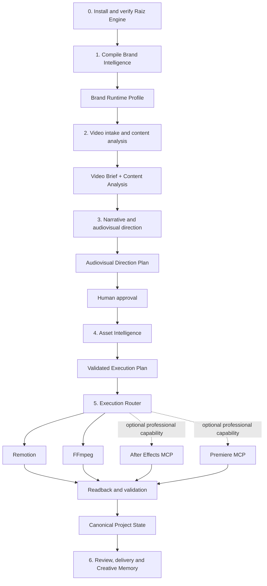

# Cena Raiz — Audiovisual Evolution and Creative Direction Plan

Status: Active Cena Raiz audiovisual evolution blueprint
Target repository: `daniela-socoloski/raiz-engine` monorepository
Current implementation roots: `apps/cena-raiz-desktop` and `skills/cena-raiz`
Primary runtime: Electron modular monolith
External execution engines: Adobe Premiere Pro MCP, Adobe After Effects MCP, Remotion, FFmpeg

## 1. Purpose

This document defines how to evolve the existing Cena Raiz video system without replacing the architecture that already works.

The goal is to add brand-aware audiovisual direction, narrative and editorial
planning, motion intelligence, asset reuse, and deterministic execution routing.
The system selects among the appropriate engines—including the locally installed
Adobe MCPs when available—while preserving:

- `TimelineModel` as the canonical non-destructive editing model.
- FFmpeg as the deterministic media-processing engine.
- Remotion as the scalable template, caption, preview, and batch-render engine.
- The current chat, approval, project, provider, runtime, packaging, and update systems.
- Original media and external editor project files.

This is an extension of the current product, not a rewrite and not a parallel video editor.

### 1.1 Role in Raiz Engine construction

This document is an active construction blueprint for evolving Cena Raiz from an
execution-focused editor into the audiovisual production consumer of Raiz Engine.
It is not a document that becomes relevant only when Adobe writes are enabled.

The following decisions govern construction now:

- typed planning and execution contracts;
- `TimelineModel` and the canonical project state;
- Brand Runtime Profile and motion direction boundaries;
- Asset Registry and reuse-before-generation policy;
- deterministic execution routing and explicit fallbacks;
- job lifecycle, idempotency, readback, validation, recovery, and human review;
- security, observability, tests, and project data layout;
- optional Adobe capability detection in bootstrap and `doctor` flows.

Only the provider-specific mutation layer remains deferred to the controlled Adobe
phase: writing through MCP tools, changing copied compositions or sequences,
rendering through Adobe, and importing selected Adobe-side changes.

`ARQUITETURA-MOTOR-CRIATIVO-RAIZ.md` owns the system-wide architecture and roadmap.
This document is its specialized audiovisual projection for Cena Raiz and must not
create a second core, timeline, router, registry, or bootstrap implementation.

## 2. Product intent

For creators and brand operators, when producing a branded video from raw footage, enable the system to plan, assemble, animate, review, and finish the video using the most appropriate execution engine, because today advanced motion requires manual translation between brand strategy, editorial decisions, Remotion code, Premiere timelines, and After Effects compositions.

Value is proven when:

- A brand profile consistently influences editing and motion decisions.
- Existing motion assets are reused before new assets are created.
- Premiere and After Effects can be controlled through bounded, validated operations.
- The same input and approved plan produce repeatable results.
- Adobe failures never corrupt the original project or canonical timeline.
- The agent spends fewer tokens describing animations and writing arbitrary code.
- A human can inspect, approve, correct, undo, and export the result.

## 3. Architectural verdict

Adopt a hybrid architecture.

- **OWN** the brand intelligence, motion profile, planning contracts, canonical timeline, asset registry, validation rules, creative memory, and review workflow.
- **EXTEND** the existing Remotion system and wrap the installed Premiere and After Effects MCP servers behind internal adapters.
- **RENT** Adobe applications, FFmpeg, WhisperX, image/video generation providers, and model runtimes as replaceable execution capabilities.
- **DEFER** unrestricted generation of entire After Effects projects and unrestricted two-way Premiere synchronization.
- **REMOVE** arbitrary model-authored fields, direct unplanned Adobe mutations, and free-form animation code as the default production path.

The Cena Raiz application remains the system of record. Premiere and After Effects are execution environments, not the owners of project state.

### Rejected alternative

Do not make Premiere or After Effects the primary project model. That would couple the product to undocumented MCP behavior, application state, version differences, UI availability, and provider-specific object identifiers. It would also weaken the existing non-destructive timeline, automated render flow, and cross-platform behavior.

### Reversal trigger

Reconsider Adobe as a system of record only if a stable, versioned, fully testable API provides deterministic read/write parity, durable identifiers, transactional operations, and reliable recovery across supported Adobe versions.

## 4. Core principles

1. The model plans; deterministic software validates and executes.
2. `TimelineModel` remains the canonical editorial state.
3. Every Adobe mutation starts from a typed execution plan.
4. Every Adobe mutation targets a duplicated sequence, composition, or project.
5. Every successful mutation requires readback and validation.
6. No model response is treated as evidence that a tool operation succeeded.
7. Existing registered assets are preferred over generating new assets.
8. Adobe-specific semantics remain inside Adobe adapters.
9. All jobs are idempotent, cancelable where supported, and auditable.
10. The user always has preview, approval, undo, fallback, and recovery paths.
11. Original media and original Adobe projects are immutable.
12. Free text is presentation. Machine-to-machine communication uses typed JSON.

## 5. Target system flow

This is an operational sequence, not a set of unrelated starting boxes. The
engine must be installed and verified first. Brand Intelligence is then compiled
once per brand and reused by every video. `VideoBrief` and `ContentAnalysis` are
artifacts produced inside the per-video intake phase; they are not parallel
product phases competing with Brand Intelligence.



Operationally, a new video starts at phase 2 only when an approved
`BrandRuntimeProfile` already exists. If it does not, the system routes the user
through phase 1 first. Adobe belongs to product phase 7 and appears above only as
an optional adapter selected by phase 5; it never blocks the core path.

## 6. Responsibility boundaries

### 6.1 Brand Intelligence

The existing `marca-raiz-prisma/inteligencias` system owns brand interpretation. It must produce a compact, versioned runtime artifact instead of injecting every intelligence document into every model turn.

Required output:

```ts
export interface BrandRuntimeProfile {
  schemaVersion: '1.0';
  brandId: string;
  version: string;
  identity: {
    essence: string[];
    positioning: string[];
    promises: string[];
    antiPatterns: string[];
  };
  voice: {
    traits: string[];
    rhythm: string[];
    prohibitedPatterns: string[];
  };
  visual: {
    colors: string[];
    typography: string[];
    compositionRules: string[];
    photographyRules: string[];
    prohibitedPatterns: string[];
  };
  motion: MotionProfile;
  provenance: Array<{
    sourceId: string;
    sourceVersion: string;
  }>;
}
```

### 6.2 Motion Intelligence

Motion Intelligence translates brand identity and video intent into motion rules. It does not create keyframes directly.

```ts
export interface MotionProfile {
  energy: 'restrained' | 'balanced' | 'expressive';
  pace: 'slow' | 'moderate' | 'fast' | 'variable';
  density: 'minimal' | 'moderate' | 'dense';
  movementTraits: string[];
  preferredEasings: string[];
  transitionFamilies: string[];
  typographyBehavior: string[];
  imageBehavior: string[];
  audioRelationship: string[];
  allowedEffects: string[];
  prohibitedEffects: string[];
  maxConcurrentMotionElements: number;
}
```

### 6.3 Video and Motion Planner

The planner decides what each scene needs and selects an execution strategy. AI is justified here because interpreting narrative, brand meaning, visual hierarchy, and scene intent is probabilistic.

The planner must not call Adobe MCP tools directly.

```ts
export interface SceneMotionNeed {
  sceneId: string;
  startFrame: number;
  endFrame: number;
  purpose:
    | 'hook'
    | 'clarify'
    | 'emphasize'
    | 'compare'
    | 'explain-data'
    | 'transition'
    | 'identify'
    | 'call-to-action';
  content: Record<string, string | number | boolean>;
  visualPriority: 'low' | 'medium' | 'high';
  preferredEngine?: 'remotion' | 'after-effects' | 'premiere' | 'ffmpeg';
  assetQuery: {
    capabilities: string[];
    brandTags: string[];
    aspectRatio: '9:16' | '16:9' | '1:1';
  };
}
```

### 6.4 Motion Asset Registry

The registry is the main token-reduction and consistency mechanism. The model selects an asset by identifier and supplies parameters instead of describing the implementation repeatedly.

Supported asset families:

- Remotion components.
- After Effects compositions.
- MOGRT templates.
- Lottie animations.
- Static or animated overlays.
- Audio transitions and sound-design elements.

```ts
export interface MotionAssetManifest {
  schemaVersion: '1.0';
  assetId: string;
  version: string;
  name: string;
  engine: 'remotion' | 'after-effects' | 'mogrt' | 'lottie' | 'media';
  source: {
    project?: string;
    composition?: string;
    component?: string;
    file?: string;
  };
  capabilities: string[];
  brandTags: string[];
  aspectRatios: Array<'9:16' | '16:9' | '1:1'>;
  duration: {
    mode: 'fixed' | 'stretchable' | 'loopable';
    defaultFrames: number;
    minFrames?: number;
    maxFrames?: number;
  };
  parameters: Record<string, MotionAssetParameter>;
  preview: {
    thumbnail: string;
    video?: string;
  };
  compatibility: {
    minAppVersion?: string;
    maxAppVersion?: string;
    requiredFonts?: string[];
    requiredPlugins?: string[];
  };
  fingerprint: string;
}

export type MotionAssetParameter =
  | { type: 'string'; required?: boolean; maxLength?: number }
  | { type: 'number'; required?: boolean; min?: number; max?: number }
  | { type: 'boolean'; required?: boolean }
  | { type: 'color'; required?: boolean }
  | { type: 'enum'; required?: boolean; values: string[] }
  | { type: 'image' | 'video' | 'audio'; required?: boolean };
```

### 6.5 Canonical Timeline

The existing `TimelineModel` remains authoritative for editorial timing and source relationships.

Extend it through versioned overlay entities rather than arbitrary top-level fields.

```ts
export interface TimelineOverlay {
  id: string;
  type: 'caption' | 'headline' | 'image' | 'video' | 'motion' | 'audio';
  timelineStart: number;
  timelineDuration: number;
  sourceRef?: string;
  assetRef?: {
    assetId: string;
    assetVersion: string;
    renderVersion?: string;
  };
  parameters?: Record<string, unknown>;
  enabled: boolean;
  provenance: {
    origin: 'user' | 'planner' | 'remotion' | 'after-effects' | 'premiere';
    jobId?: string;
  };
}
```

Unknown fields may be preserved for backward compatibility, but new production behavior must use official schemas.

## 7. Execution router

The router selects an engine using deterministic rules after the planner identifies the visual need.

Initial routing policy:

| Need | Primary engine | Fallback |
|---|---|---|
| Clean cut, concat, proxy, audio, J-cut | FFmpeg | None |
| Captions, headlines, standard split layouts | Remotion | FFmpeg-safe render |
| Registered reusable motion component | Asset-defined engine | Remotion placeholder |
| Custom branded motion or complex composition | After Effects MCP | Remotion simplified version |
| Professional timeline assembly and human finishing | Premiere MCP | Canonical timeline + app render |
| MOGRT placement | Premiere MCP | Pre-rendered asset |

The planner may recommend an engine, but the router is authoritative and must verify availability, compatibility, required plugins, project state, and fallback readiness.

## 8. Adobe integration architecture

### 8.1 Capability probe

Do not assume tool names or behavior from repository documentation. At runtime and during development, inspect the installed MCP servers and record their actual capabilities.

The probe must determine:

- MCP server identity and version.
- Available tool names and schemas.
- Installed Adobe application version.
- Whether the application is running.
- Supported project, sequence, composition, layer, keyframe, expression, render, and export operations.
- Whether tool calls are synchronous or asynchronous.
- Identifier stability across calls and application restarts.
- Required panels, scripts, extensions, permissions, and ports.
- Timeout and cancellation behavior.
- Readback capability.
- Known unsupported operations.

Persist a sanitized capability snapshot:

```ts
export interface AdobeCapabilitySnapshot {
  schemaVersion: '1.0';
  capturedAt: string;
  server: {
    id: string;
    version?: string;
  };
  application: {
    kind: 'premiere-pro' | 'after-effects';
    version?: string;
    running: boolean;
  };
  tools: Array<{
    name: string;
    inputSchemaHash: string;
    supported: boolean;
    notes?: string[];
  }>;
}
```

Never persist credentials, OAuth codes, cookies, tokens, or sensitive MCP transport payloads.

### 8.2 Verified local-machine snapshot and portable installation contract

Captured on `2026-08-20` from the current Windows machine. This snapshot is
verified operational evidence, not a requirement that future machines use the
username `RAIZ`, Adobe version `2026`, or the same absolute directories.

Resolved roots on this machine:

| Resolver | Verified value |
|---|---|
| `<USER_HOME>` | `C:\Users\RAIZ` |
| `<ROAMING_APP_DATA>` | `C:\Users\RAIZ\AppData\Roaming` |
| `<LOCAL_APP_DATA>` | `C:\Users\RAIZ\AppData\Local` |
| `<TEMP>` | `C:\Users\RAIZ\AppData\Local\Temp` |
| `<PROGRAM_FILES>` | `C:\Program Files` |
| `<AE_PROFILE_VERSION>` | `26.3` |

Verified addresses and their portable equivalents:

| Capability | Verified address on this machine | Portable path rule |
|---|---|---|
| Node.js executable | `C:\Program Files\nodejs\node.exe` | Resolve `node` from `PATH`; do not assume `Program Files` |
| After Effects application | `C:\Program Files\Adobe\Adobe After Effects 2026\Support Files\AfterFX.exe` | Detect installed supported versions under Adobe installation metadata or registered application paths |
| After Effects MCP root | `C:\Users\RAIZ\mcp-servers\after-effects-mcp` | `<USER_HOME>\mcp-servers\after-effects-mcp` |
| After Effects MCP entry | `C:\Users\RAIZ\mcp-servers\after-effects-mcp\build\index.js` | `<USER_HOME>\mcp-servers\after-effects-mcp\build\index.js` |
| After Effects ScriptUI panel | `C:\Users\RAIZ\AppData\Roaming\Adobe\After Effects\26.3\Scripts\ScriptUI Panels\mcp-bridge-auto.jsx` | `<ROAMING_APP_DATA>\Adobe\After Effects\<AE_PROFILE_VERSION>\Scripts\ScriptUI Panels\mcp-bridge-auto.jsx` |
| After Effects file bridge | `C:\Users\RAIZ\Documents\ae-mcp-bridge` | Resolve the Windows Documents known folder, then append `ae-mcp-bridge` |
| Premiere Pro application | `C:\Program Files\Adobe\Adobe Premiere Pro 2026\Adobe Premiere Pro.exe` | Detect installed supported versions under Adobe installation metadata or registered application paths |
| Premiere MCP root | `C:\Users\RAIZ\mcp-servers\Adobe_Premiere_Pro_MCP` | `<USER_HOME>\mcp-servers\Adobe_Premiere_Pro_MCP` |
| Premiere MCP entry | `C:\Users\RAIZ\mcp-servers\Adobe_Premiere_Pro_MCP\dist\index.js` | `<USER_HOME>\mcp-servers\Adobe_Premiere_Pro_MCP\dist\index.js` |
| Premiere CEP panel | `C:\Users\RAIZ\AppData\Roaming\Adobe\CEP\extensions\MCPBridgeCEP` | `<ROAMING_APP_DATA>\Adobe\CEP\extensions\MCPBridgeCEP` |
| Premiere file bridge | `C:\Users\RAIZ\AppData\Local\Temp\premiere-mcp-bridge` | `<TEMP>\premiere-mcp-bridge` |
| Codex configuration | `C:\Users\RAIZ\.codex\config.toml` | `<USER_HOME>\.codex\config.toml` |
| Claude Code executable | `C:\Users\RAIZ\.local\bin\claude.exe` | Resolve `claude` from `PATH`; use `<USER_HOME>\.local\bin\claude.exe` only as a detected Windows fallback |
| Claude Desktop configuration | `C:\Users\RAIZ\AppData\Roaming\Claude\claude_desktop_config.json` | `<ROAMING_APP_DATA>\Claude\claude_desktop_config.json` |

Verified MCP sources:

| Server | Package | Verified source | Verified revision | Entry | License file |
|---|---|---|---|---|---|
| After Effects | `after-effects-mcp@1.0.0` | `https://github.com/Dakkshin/after-effects-mcp.git` | `88d5fbf08b7ae9f015ee98e5f8c4904095cf8202` | `build/index.js` | `LICENSE` |
| Premiere Pro | `adobe-premiere-pro-mcp@1.2.0` | `https://github.com/hetpatel-11/Adobe_Premiere_Pro_MCP.git` | `50f534b17639aafc615a10b38325957bf73e6515` | `dist/index.js` | `LICENSE.md` |

Inherited-base issue disclosed from executable evidence:

- Origin: `INHERITED` from the third-party After Effects MCP.
- Affected responsibility: portable resolution of the After Effects file bridge.
- Evidence: the compiled server derives the bridge with
  `path.join(homeDir, "Documents", "ae-mcp-bridge")`.
- Current effect: it resolves correctly on this machine.
- Risk: it can target the wrong directory when the Windows Documents known folder
  is redirected, localized, or managed through OneDrive.
- Required treatment: the future bootstrap and `doctor` must resolve and probe the
  actual known folder or supply a verified configurable bridge path before claiming
  support for those profiles. Do not silently classify the current hard-coded
  derivation as portable.

Current client-registration state:

| Client | After Effects | Premiere Pro | Required treatment |
|---|---|---|---|
| Claude Desktop | Registered | Registered | Preserve and validate; do not duplicate entries |
| Claude Code | Registered at user scope | Registered at user scope | Preserve and validate; future bootstrap must reproduce the local stdio registrations |
| Codex | Registered; next session required | Registered; next session required | Preserve and validate; future bootstrap must reproduce the local `mcp_servers` entries |

This registration state is expected to change. Any agent that changes it must
update this snapshot in the same change set or replace it with a generated,
sanitized capability report referenced from here.

Portable installation sequence for a future Windows developer machine:

1. Resolve the environment roots and installed Adobe versions; never substitute a
   copied username or version number.
2. Check whether each MCP checkout, compiled entry, panel, bridge directory, and
   client registration already exists before changing anything.
3. Clone only the registered upstream source and verify the selected revision,
   package version, and applicable license before building.
4. Use the repository lockfile and documented build command; do not copy
   `node_modules` from another machine.
5. Install Adobe panels in the user profile when supported, detecting the actual
   After Effects profile version and CEP location.
6. Generate local Codex and Claude Code registrations from the resolved paths.
   Machine-specific generated configuration must not become a shared repository
   requirement and must never contain credentials.
7. Start with read-only capability probes and bridge diagnostics. Adobe mutation
   tools remain disabled until the global controlled Adobe phase.
8. Persist a sanitized capability snapshot containing versions, paths, source
   revisions, tool schemas, and readiness states, but no tokens or private data.

The executable implementation of this contract belongs to
`operations/bootstrap/toolchain.json`, `raiz-bootstrap.ps1`, and
`raiz-doctor.ps1`. Until those files explicitly declare Adobe support, this section
documents the required future behavior; it does not claim the current bootstrap
already installs or registers Adobe MCPs.

### 8.3 Internal adapters

Application code must call internal adapters, not provider tool names.

```ts
export interface AfterEffectsAdapter {
  probe(): Promise<AdobeCapabilitySnapshot>;
  inspectProject(request: InspectAeProjectRequest): Promise<AeProjectSnapshot>;
  instantiateAsset(request: MotionExecutionPlan): Promise<AdobeJobResult>;
  renderPreview(request: MotionPreviewRequest): Promise<AdobeJobResult>;
  readback(request: AdobeReadbackRequest): Promise<AdobeReadbackResult>;
  cancel(jobId: string): Promise<void>;
}

export interface PremiereAdapter {
  probe(): Promise<AdobeCapabilitySnapshot>;
  inspectProject(request: InspectPremiereProjectRequest): Promise<PremiereProjectSnapshot>;
  createSequence(request: PremiereSequencePlan): Promise<AdobeJobResult>;
  applyTimeline(request: PremiereTimelinePlan): Promise<AdobeJobResult>;
  placeMotionAssets(request: PremierePlacementPlan): Promise<AdobeJobResult>;
  exportSequence(request: PremiereExportRequest): Promise<AdobeJobResult>;
  readback(request: AdobeReadbackRequest): Promise<AdobeReadbackResult>;
  cancel(jobId: string): Promise<void>;
}
```

### 8.4 Adobe worker

Run Adobe MCP orchestration in a dedicated local worker controlled by the Electron main process.

Responsibilities:

- Serialize mutations per Adobe project.
- Maintain job state.
- Apply timeouts and bounded retries.
- Prevent concurrent writes to the same project or sequence.
- Emit progress events to the renderer.
- Handle application-not-running and panel-not-connected states.
- Reconcile partial success through readback.
- Sanitize logs.
- Support cancellation when the MCP transport supports it.

Do not create a separate cloud service for the first version. Keep this inside the current modular Electron application.

### 8.5 Job state machine

```text
queued
  -> probing
  -> validating
  -> preparing-copy
  -> executing
  -> reading-back
  -> validating-result
  -> preview-ready
  -> approved
  -> committed

Any active state may move to:
  -> cancelled
  -> retryable-failure
  -> terminal-failure
  -> needs-human-action
```

Every transition must be persisted atomically and include a timestamp, job identifier, project identifier, engine, operation, attempt number, and sanitized result classification.

## 9. After Effects MCP role

After Effects is the specialized motion-authoring and rendering engine.

Allowed MVP operations:

- Inspect a known `.aep` project.
- Duplicate a registered source composition.
- Set registered text, color, number, image, video, and enum parameters.
- Update explicitly registered keyframes or expression controls.
- Render a preview or transparent intermediate.
- Read back composition, layer, duration, and render state.

Not allowed in the MVP:

- Editing an unregistered composition.
- Mutating the original source composition.
- Installing third-party plugins.
- Executing arbitrary scripts written by the model.
- Generating an entire unknown `.aep` project without a human-approved recipe.
- Treating a tool response as render success without checking the output.

Example plan:

```ts
export interface MotionExecutionPlan {
  schemaVersion: '1.0';
  jobId: string;
  projectId: string;
  asset: {
    assetId: string;
    version: string;
    fingerprint: string;
  };
  target: {
    engine: 'after-effects';
    sourceProject: string;
    sourceComposition: string;
    outputComposition: string;
  };
  timeline: {
    startFrame: number;
    durationFrames: number;
    fps: number;
    width: number;
    height: number;
  };
  parameters: Record<string, string | number | boolean>;
  mediaBindings: Record<string, string>;
  output: {
    format: 'mov-prores-4444' | 'png-sequence' | 'mp4-preview';
    relativePath: string;
  };
}
```

## 10. Premiere MCP role

Premiere is the professional editorial handoff and finishing environment.

Allowed MVP operations:

- Inspect an existing project.
- Create or duplicate a Cena Raiz sequence.
- Place source clips from canonical timeline ranges.
- Place audio, captions, images, videos, MOGRTs, and rendered motion assets.
- Add deterministic markers containing Cena Raiz identifiers.
- Export a review file.
- Read back the created sequence for verification.

Not allowed in the MVP:

- Mutating an unrelated user sequence.
- Deleting bins, source clips, sequences, or project media.
- Making Premiere the canonical timeline.
- Automatically importing arbitrary human edits back into Cena Raiz.
- Assuming Premiere object identifiers remain stable without verification.

Every created sequence must contain:

- `projectId`.
- `timelineVersion`.
- `jobId`.
- Source media fingerprints.
- A visible versioned name such as `CENA_RAIZ_<project>_v003`.

## 11. Readback and validation

Readback means querying the execution environment after a mutation and comparing the observed state with the planned state.

Validation must check, where supported:

- Sequence or composition exists.
- Correct duration and frame rate.
- Correct resolution and aspect ratio.
- Expected track, layer, and clip count.
- Expected source references.
- Expected start and end frames within tolerance.
- Expected parameter values.
- Render file exists and is non-empty.
- FFprobe can open rendered media.
- Output duration is within one frame of the plan.
- Required alpha channel exists when requested.
- No missing fonts, plugins, media, or offline assets.

If readback is incomplete, the job must be marked `needs-human-action`; it must not silently become successful.

## 12. Project data layout

Proposed additions inside each video project:

```text
edit/
  brand/
    runtime-profile.json
  planning/
    video-brief.json
    narrative-plan.json
    scene-plan.json
    motion-brief.json
  motion/
    recipes/
    jobs/
    previews/
    renders/
    registry-lock.json
  adobe/
    capabilities/
    premiere/
      snapshots/
      exports/
    after-effects/
      snapshots/
      projects/
      renders/
  timeline.json
  edl.json
```

All persisted files require a schema version. Generated outputs must be versioned and never overwrite an approved output.

## 13. Proposed source modules

Adapt names to the repository conventions after inspection.

```text
src/
  domain/
    brand/
      brand-runtime-profile.ts
      motion-profile.ts
    motion/
      motion-brief.ts
      motion-asset-manifest.ts
      motion-execution-plan.ts
      motion-job.ts
    editorial/
      timeline-overlay.ts
      premiere-sequence-plan.ts

  application/
    motion/
      compile-brand-runtime-profile.ts
      plan-scene-motion.ts
      search-motion-assets.ts
      instantiate-motion-asset.ts
      validate-motion-result.ts
    editorial/
      build-premiere-sequence-plan.ts
      sync-premiere-sequence.ts
      validate-premiere-readback.ts

  infrastructure/
    adobe/
      adobe-worker.ts
      adobe-job-store.ts
      adobe-capability-probe.ts
      adobe-errors.ts
      after-effects-mcp-adapter.ts
      premiere-mcp-adapter.ts
      mcp-transport.ts
    motion-assets/
      filesystem-motion-asset-registry.ts

resources/
  motion-assets/
    manifests/
    previews/
    after-effects/
    mogrt/
    remotion/
    lottie/
```

Do not move existing working modules merely to match this diagram. Introduce boundaries incrementally and avoid unrelated refactors.

## 14. AI context and token strategy

The full intelligence library must not be inserted into every conversation turn.

Use a compilation and routing strategy:

1. Compile stable brand decisions into `BrandRuntimeProfile`.
2. Select only relevant intelligence modules for the current task.
3. Pass asset manifests rather than implementation source code.
4. Pass timeline summaries and scene windows rather than entire project histories.
5. Use IDs and structured parameters for registered assets.
6. Persist decisions in project files so the model does not need to reconstruct them.
7. Cache deterministic analysis by source fingerprint.
8. Record user corrections as structured preferences, not chat-only memory.

Suggested context envelope for motion planning:

```ts
export interface MotionPlanningContext {
  brandProfile: Pick<
    BrandRuntimeProfile,
    'brandId' | 'version' | 'voice' | 'visual' | 'motion'
  >;
  videoBrief: VideoBrief;
  scenes: ScenePlan[];
  availableAssets: Array<Pick<
    MotionAssetManifest,
    'assetId' | 'version' | 'engine' | 'capabilities' | 'brandTags' | 'parameters'
  >>;
  userCorrections: CreativePreference[];
  runtimeCapabilities: {
    remotion: boolean;
    afterEffects: boolean;
    premiere: boolean;
    ffmpeg: boolean;
  };
}
```

## 15. Security and trust boundaries

- MCP servers run locally and receive only paths inside the active project or approved asset registry.
- Resolve and validate all paths before any tool call.
- Reject path traversal, external paths, unresolved environment variables, and unsafe globs.
- Never expose credentials or raw authentication files to model context.
- Maintain explicit allowlists for Adobe operations.
- Never install Adobe plugins or execute arbitrary ExtendScript/UXP code generated during a chat turn.
- Sanitize project names and generated identifiers.
- Preserve an audit log without raw model prompts, secrets, or unnecessary personal data.
- Treat imported `.aep`, `.prproj`, MOGRT, fonts, and third-party plugins as supply-chain inputs requiring provenance.
- Require explicit user confirmation before opening or mutating an existing Adobe project not created by Cena Raiz.

## 16. Reliability rules

- One active mutation job per Adobe project.
- Repeated `jobId` requests return the existing result instead of duplicating work.
- Retry only transient transport, application-busy, and rate-limit failures.
- Do not retry schema, unsupported-operation, missing-plugin, missing-media, or validation failures automatically.
- Use exponential backoff with a bounded attempt count.
- Persist job state before and after each external call.
- On process restart, reconcile all non-terminal jobs through readback.
- Provide a degraded path using Remotion or a pre-rendered asset when Adobe is unavailable.
- Adobe failure must never block the core clean-cut editing workflow.
- Preview failure must never overwrite the last approved render.

Recommended error taxonomy:

```ts
export type AdobeErrorCode =
  | 'MCP_UNAVAILABLE'
  | 'APP_NOT_RUNNING'
  | 'PANEL_NOT_CONNECTED'
  | 'UNSUPPORTED_OPERATION'
  | 'INVALID_PLAN'
  | 'PROJECT_NOT_FOUND'
  | 'MEDIA_OFFLINE'
  | 'FONT_MISSING'
  | 'PLUGIN_MISSING'
  | 'TIMEOUT'
  | 'CANCELLED'
  | 'PARTIAL_SUCCESS'
  | 'READBACK_MISMATCH'
  | 'RENDER_FAILED'
  | 'EXPORT_FAILED'
  | 'UNKNOWN_ADOBE_FAILURE';
```

## 17. User experience

Adobe complexity should not move into the chat.

Add visual states and controls:

- Adobe connection status in Settings > Connections.
- Premiere and After Effects capability details.
- `Create motion` action after audiovisual direction approval and capability validation.
- Motion suggestions shown as visual cards with preview, purpose, engine, and duration.
- `Use existing`, `Create variation`, and `Do not use` decisions.
- Render progress below the relevant motion item.
- `Open in After Effects` and `Open in Premiere` only when a valid local project exists.
- `Send to Premiere` as an explicit handoff action.
- Comparison between Cena Raiz preview and Adobe result.
- Clear recovery action when Adobe is closed, disconnected, missing media, or missing a plugin.

Do not require the user to type technical approval phrases.

## 18. Observability and evaluation

Track system health separately from creative quality and product value.

### System health

- MCP connection success rate.
- Adobe job success and failure rate by operation.
- Job duration and timeout rate.
- Retry count.
- Readback mismatch rate.
- Render and export failure categories.
- Recovery success after restart.

### Model quality

- Asset-selection acceptance rate.
- Percentage of plans that pass schema validation.
- Percentage of suggestions rejected as off-brand.
- Number of user corrections per video.
- Motion density and timing corrections.
- Fallback rate from After Effects to Remotion.

### Product value

- Time from clean cut approval to approved motion preview.
- Time from video brief to final export.
- Percentage of assets reused.
- Token usage per finished minute.
- Number of manual Adobe actions required.
- Percentage of videos completed without leaving Cena Raiz.

Do not log full prompts, credentials, source transcripts, or unnecessary local paths.

## 19. Implementation roadmap

These work packages are subordinate to the global phases in
`ARQUITETURA-MOTOR-CRIATIVO-RAIZ.md`. They do not authorize agents to start Adobe
before the repository execution gate allows it. Their numbers are local delivery
packages, not a second lifecycle: product phase 0 still owns installation, product
phase 1 still owns Brand Intelligence, and the video flow starts only afterward.
Work packages 0–3 shape the audiovisual consumer after their corresponding global
phase prerequisites are available. Work packages 4–7 activate the Adobe-specific
runtime progressively; Adobe writes begin only in global product phase 7.

### Work package 0 — Repository and capability discovery

Goal: establish verified current state before changing architecture.

Tasks:

- Inspect repository structure, branch, dirty worktree, package scripts, types, IPC contracts, and tests.
- Locate the current developer instructions and all places that parse or invent fields for the inherited Cena Raiz Phase 2 workflow.
- Inspect the installed Premiere and After Effects MCP configurations.
- Enumerate actual MCP tools and schemas.
- Verify both Adobe applications and their required panels/extensions.
- Revalidate the paths, sources, revisions, and client-registration state in section 8.2.
- Produce capability snapshots and a gap report.
- Create ADR-001 with the final adapter boundaries.

Acceptance criteria:

- No production behavior changed.
- No user files mutated.
- Actual MCP capabilities are documented from inspection, not assumption.
- Unsupported requirements are explicitly marked.

### Work package 1 — Brand Runtime compilation

Goal: make the output of product phase 1 consumable by Cena Raiz without calling
Adobe or injecting the complete brand kernel into each video task.

Tasks:

- Finalize the versioned `BrandRuntimeProfile` and `MotionProfile` schemas and validators.
- Implement `compileBrandRuntimeProfile` from the canonical
  `marca-raiz-prisma/inteligencias` method and project evidence.
- Preserve source IDs, source versions, compiler version, warnings, and human approval.
- Validate the compiler against the three canonical brand cases.
- Persist the approved profile separately from per-video project state.

Acceptance criteria:

- The same brand evidence compiles deterministically.
- Invalid or incomplete profiles never reach video planning.
- Cena Raiz consumes the compact profile without loading the full intelligence corpus.
- Human corrections produce a new version with provenance rather than mutating history silently.

### Work package 2 — Video intake and audiovisual direction

Goal: connect the approved brand profile, video objective, and analyzed content to
the owned direction contracts before selecting assets or an execution engine.

Tasks:

- Add and validate `VideoBrief` and `ContentAnalysis`.
- Produce `NarrativePlan`, `AudiovisualDirectionPlan`, and `SceneMotionNeed[]`.
- Make every text, image, silence, sound, and motion decision cite a narrative or brand purpose.
- Show the plan for human approval before execution compilation.
- Persist approval, rejection, replacement, and parameter corrections.

Acceptance criteria:

- Every scene decision traces to the brief, content evidence, or approved brand profile.
- No execution engine is selected before the direction plan is validated and approved.
- The system abstains when evidence is insufficient instead of inventing a direction.
- Reopening the project restores the active approved plan.

### Work package 3 — Asset registry and execution router without Adobe mutations

Goal: improve the existing Cena Raiz production engine before making Adobe a runtime
dependency.

Tasks:

- Add versioned schemas and validators for `MotionAssetManifest`,
  `MotionExecutionPlan`, and `MotionJob`.
- Implement filesystem registry discovery and validation.
- Register 5–10 existing assets, beginning with current Remotion components.
- Generate or attach thumbnail and preview references; rank only compatible assets.
- Route clean cuts, media operations, and audio work to FFmpeg.
- Route registered layouts, captions, and reusable motion to Remotion.
- Validate `ValidatedExecutionPlan` before dispatch.
- Persist job state and perform output readback.
- Provide explicit unavailable-engine and simplified-render fallbacks.
- Preserve the current Cena Raiz editing, approval, installer, and updater behavior.

Acceptance criteria:

- Registry loads deterministically; duplicate, invalid, or incompatible assets do
  not reach the planner.
- Every selected asset cites an ID, source, compatibility result, and scene purpose.
- The same approved plan produces repeatable routing decisions.
- Cena Raiz remains usable when Adobe applications and MCP servers are absent.
- Failed execution never overwrites an approved result.
- Provider-specific semantics do not escape adapter boundaries.

### Work package 4 — Adobe capability layer

Goal: establish safe, provider-specific adapters, beginning with read-only inspection.

Tasks:

- Implement the MCP transport abstraction.
- Implement `AdobeCapabilityProbe`.
- Implement typed Premiere and After Effects adapters for read-only inspection.
- Add normalized error mapping.
- Add connection status and diagnostics to the application.
- Build contract tests using recorded, sanitized MCP responses.

Acceptance criteria:

- Application can detect unavailable, disconnected, unsupported, and ready states.
- Provider-specific response shapes do not escape the adapter layer.
- No mutation tool is enabled without a verified capability.

### Work package 5 — After Effects registered-asset loop

Goal: prove `select -> parameterize -> execute -> readback -> preview`.

Tasks:

- Select two simple registered After Effects compositions.
- Duplicate the source composition for every job.
- Apply only registered parameters.
- Render MP4 preview and one alpha-capable intermediate.
- Read back composition and render state.
- Validate output with FFprobe.
- Add preview, approval, retry, cancel, and fallback UI.

Acceptance criteria:

- Original `.aep` and source compositions remain unchanged.
- Repeating a completed job does not create duplicate compositions or renders.
- Output duration differs from plan by no more than one frame.
- Failed jobs preserve the last approved result.
- Remotion fallback is available.

### Work package 6 — Premiere sequence handoff

Goal: create a professional finishing sequence from canonical state.

Tasks:

- Convert `TimelineModel` and overlays into `PremiereSequencePlan`.
- Create a versioned Cena Raiz sequence in a copied or dedicated project.
- Place clips, audio, captions, images, motion renders, and supported MOGRTs.
- Add Cena Raiz identifiers as markers or metadata.
- Read the sequence back and compare timing and source references.
- Export a review file.

Acceptance criteria:

- No unrelated sequence is mutated.
- All planned video cuts match within one frame.
- Missing media produces a recoverable error.
- Sequence readback is stored as a snapshot.
- The canonical timeline remains unchanged unless the user explicitly approves an import operation.

### Work package 7 — Controlled two-way synchronization

Goal: import selected human Adobe changes only after one-way handoff is reliable.

Do not start this work package until work package 6 has a low readback mismatch rate
across real projects.

Potential scope:

- Detect timing differences in a Cena Raiz-owned Premiere sequence.
- Present a visual diff.
- Let the user choose which changes to import.
- Convert supported changes into canonical timeline commands.
- Reject or preserve unsupported Adobe-only changes as external overlays.

## 20. MVP hypothesis and stop conditions

### Core hypothesis

Structured brand intelligence and an approved audiovisual direction plan can make
the existing Cena Raiz production engine produce more coherent, repeatable, and
brand-specific editorial decisions without depending on Adobe.

### Core MVP slice

- One real `BrandRuntimeProfile`.
- One vertical short-form video supported by the current Cena Raiz timeline.
- One reviewable `AudiovisualDirectionPlan`.
- Five registered Remotion assets.
- FFmpeg and Remotion execution through a validated plan and explicit router.
- Human approval, readback, correction, and persisted creative decisions.

This core slice is the first product proof. It must remain installable and useful on
a supported machine without Premiere Pro, After Effects, or their MCP servers.

### Adobe extension hypothesis

A registered-asset workflow using the installed After Effects MCP can produce more sophisticated, brand-consistent motion with less model context and less manual work than generating each animation as new Remotion code.

### Adobe validation slice

- One real brand profile.
- One vertical short-form video.
- Two registered After Effects assets.
- Five existing Remotion assets.
- One After Effects preview workflow.
- One Premiere sequence handoff.

This slice begins only after the core slice and the global controlled Adobe gate are
accepted.

### Success threshold

- At least 80% of Adobe jobs finish without manual technical intervention.
- Zero mutation of original projects or media.
- All accepted timing results are within one frame.
- At least 50% of motion decisions reuse registered assets.
- Model context for an asset placement is materially smaller than the current custom-code prompt and source context.
- User can complete review and recovery without reading raw MCP errors.
- The core Cena Raiz workflow remains green and usable when Adobe is unavailable.

### Stop or redesign conditions

- The MCP cannot provide reliable readback.
- Identifiers are too unstable to support idempotency.
- More than 20% of jobs corrupt, duplicate, or misplace assets after adapter stabilization.
- Required Adobe UI/panel state creates unacceptable user friction.
- Cross-version behavior cannot be bounded by capability probes.
- A simpler Remotion or MOGRT path produces equivalent quality and control.
- Structured direction does not improve brand coherence or reduce revision burden
  relative to the existing Cena Raiz baseline.

## 21. Testing strategy

Add tests in layers.

### Unit tests

- Schema validation.
- Asset compatibility and ranking.
- Engine routing.
- Path safety.
- Plan normalization.
- Error classification.
- Timeline-to-Premiere conversion.
- Readback comparison.
- Idempotency keys.

### Contract tests

- Recorded and sanitized MCP tool schemas.
- Provider response normalization.
- Unsupported tool behavior.
- Timeout, partial success, cancellation, and reconnect behavior.

### Integration tests

- Read-only project inspection.
- Composition duplication.
- Registered parameter application.
- Preview render.
- Premiere sequence creation.
- Sequence readback.

### End-to-end tests

- Brand profile -> motion plan -> asset selection -> AE preview -> approval -> timeline overlay.
- Canonical timeline -> Premiere sequence -> readback -> review export.
- Application restart during a running job -> reconciliation.
- Adobe unavailable -> degraded Remotion path.

Real Adobe tests must run behind explicit environment flags and must use disposable fixtures, never personal projects.

## 22. First Codex or Claude Code execution instructions

When this document is first given to Codex or Claude Code, obey the current
repository execution gate. Before the global controlled Adobe phase, execute only
the read-only parts of work package 0; do not interpret this blueprint as authority
to enable Adobe writes.

Use this instruction:

```text
Read docs/architecture/cena-raiz-audiovisual-evolution.md, AGENTS.md, ARQUITETURA-MOTOR-CRIATIVO-RAIZ.md, and the current repository execution gate completely.

Work only in the raiz-engine monorepository and inside the explicitly authorized file scope. Preserve the Cena Raiz desktop, Cena Raiz skill, and unrelated worktree changes.

For this turn, perform the permitted read-only portion of work package 0 only. Inspect the repository and the actually installed Premiere Pro and After Effects MCP capabilities. Do not implement mutation operations, install packages, change runtime versions, create a new architecture beside the existing TimelineModel, or modify user Adobe projects.

Deliver:
1. Current Architecture Map.
2. MCP Capability Matrix based on actual discovered tools and schemas.
3. Gap Analysis against this plan.
4. ADR-001 with the proposed adapter boundaries.
5. Minimal file-by-file implementation plan mapped to the global Raiz Engine roadmap.
6. Risks and unknowns that can materially change the architecture.

Clearly separate verified evidence, inference, and recommendation. Preserve the dirty worktree and do not expose credentials or absolute local paths in user-facing output.
```

## 23. Definition of done for the full initiative

The Adobe integration is complete when:

- Brand intelligence compiles into a versioned runtime profile.
- Motion decisions use typed scene needs and registered assets.
- The system chooses Remotion, FFmpeg, After Effects, or Premiere through an explicit router.
- Adobe MCPs are isolated behind tested internal adapters.
- All Adobe writes are duplicated, versioned, idempotent, and followed by readback.
- The canonical timeline remains recoverable and authoritative.
- A user can preview, approve, reject, retry, cancel, and fall back visually.
- Original media and Adobe projects are never overwritten.
- Token usage, asset reuse, failures, corrections, and completion time are measurable.
- Mac and Windows behavior is validated on real machines.
- The bootstrap detects existing Adobe capabilities and can reproduce their local
  setup without hardcoded usernames, copied dependencies, or committed credentials.
- The existing clean-cut, J-Cut, inherited Phase 2, provider, installer, and updater flows remain green.

## 24. Immediate next decision

The immediate engineering decision for the owned core is:

**At which verified seam can `AudiovisualDirectionPlan` and
`ValidatedExecutionPlan` enter the current Cena Raiz workflow without replacing
`TimelineModel` or changing inherited behavior before approval?**

The Adobe activation decision remains a later gate based on read-only capability
evidence:

**Can the installed After Effects MCP and Premiere MCP provide sufficient readback and identifier stability to support safe, idempotent adapters?**

If yes, activate the Adobe work packages only when the global roadmap reaches the
controlled Adobe phase. If no, keep the same owned domain architecture and replace
MCP mutation with a controlled local bridge, MOGRT workflow, ExtendScript/UXP
adapter, or render-only integration.
