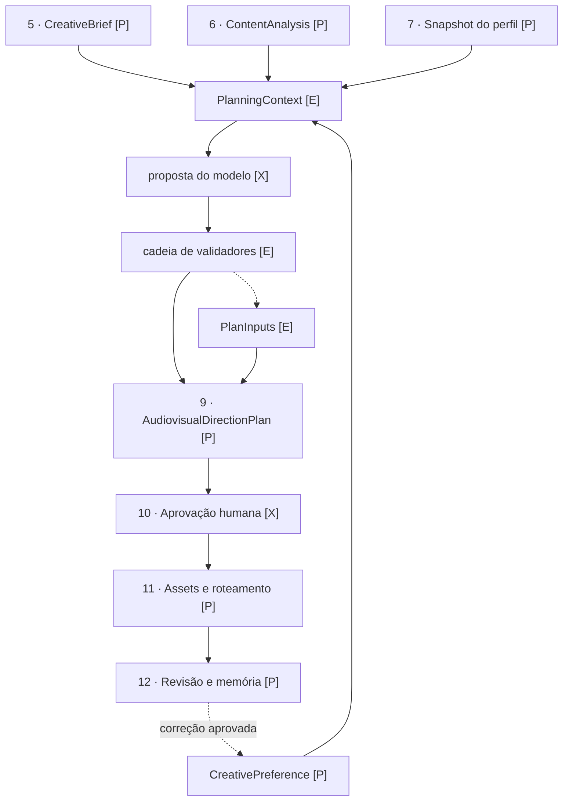

# Pipeline de produção: passos 5 → 12

Um README por fase. Cada um diz o que a fase responde, onde vive o código, como
ela se conecta com a seguinte e o que ainda falta.

A norma arquitetural é [`docs/architecture/LOGICA-PIPELINE-CRIATIVO.md`](../../../docs/architecture/LOGICA-PIPELINE-CRIATIVO.md).
Estes documentos não a substituem: descrevem o estado real do código em
`packages/` e apontam o trabalho restante fase a fase.

| Fase | Documento | Estado |
|---|---|---|
| 5 | [CreativeBrief](passo-5-creative-brief.md) | **parcial** — contrato, validador e teste prontos; persistência falta |
| 6 | [ContentAnalysis](passo-6-content-analysis.md) | **parcial** — contrato, validador, cache e teste prontos; o analisador não grava o contrato |
| 7 | [Snapshot do perfil de marca](passo-7-brand-profile-snapshot.md) | **parcial** — perfil e compilador prontos; o snapshot da produção não existe |
| 8 | [VideoAndMotionPlanner](passo-8-video-and-motion-planner.md) | **parcial** — `PlanningContext`, assembler e cadeia de validadores existem; a proposta do modelo e a montagem do plano não |
| 9 | [AudiovisualDirectionPlan](passo-9-audiovisual-direction-plan.md) | **parcial** — plano existe no app herdado; entradas e unidade de cena precisam migrar |
| 10 | [Aprovação humana](passo-10-human-approval.md) | **planejado** — nenhuma implementação |
| 11 | [Seleção de assets e roteamento](passo-11-asset-selection-and-execution-routing.md) | **parcial** — Motion Asset Registry e `ExecutionConstraint` existem; os outros registries, o compilador e o router não |
| 12 | [Revisão, entrega e memória](passo-12-review-delivery-and-creative-memory.md) | **parcial** — `CreativePreference` e seu desempate existem; validação de resultado, entrega e memória não |

Nenhuma fase está fechada. "Parcial" significa que há contrato e validador, não
que o passo roda.

## O mapa

Marcadores: `[E]` existe · `[P]` parcial · `[X]` planejado.



Os passos 5, 6 e 7 são **entradas independentes**, não uma corrente serial. O
brief não espera a análise; a análise não espera o perfil. O que os une é
convergirem no mesmo contexto — e o passo 8 só começa quando os três existem.

O laço de volta do 12 ao 8 é o que torna o sistema capaz de aprender: correção
humana aprovada vira `CreativePreference` e reentra na próxima produção.

## As duas espinhas

São contratos distintos e a distinção importa:

```text
PlanningContext   o que ENTRA no planner, montado e validado ANTES
PlanInputs        o que o planner USOU, registrado DEPOIS
```

| | `PlanningContext` | `PlanInputs` |
|---|---|---|
| Momento | antes da proposta | depois da proposta |
| Carrega | o conteúdo dos artefatos | ponteiros versionados |
| Serve para | o planner não reler o corpus | a decisão ser reaberta e contestada |
| Contrato | [`planning-context.ts`](../../contracts/production/planning-context.ts) | [`plan-inputs.ts`](../../contracts/production/plan-inputs.ts) |
| Código | [`assemble-planning-context.ts`](../../core/production/assemble-planning-context.ts) | [`validate-plan-inputs.ts`](../../core/production/validate-plan-inputs.ts) |

`PlanInputs` guarda **ponteiros**, nunca uma segunda cópia do conteúdo. O brief
continua no `creative-brief.json`; a análise continua no `content-analysis.json`.
Duplicar criaria duas verdades e a obrigação de sincronizá-las.

Com `comparePlanInputs`, o plano deixa de ser uma opinião sem data:

1. **Reabrir uma produção antiga** e provar qual perfil de marca a governou.
2. **Saber que uma fonte mudou** e que só as cenas que dependiam dela
   envelheceram — sem reprocessar o resto.
3. **Mostrar qual preferência venceu** um conflito, e qual perdeu.

## Conhecimento que o pipeline consulta

Não são passos: são dicionários que dão significado aos campos dos contratos.

| Documento | Dá significado a |
|---|---|
| [Gramática de motion](../../../skills/cena-raiz/references/motion-grammar.md) | `MotionNeed.patternFamily`, envelopes, overshoot, safe zones |
| [Áudio e verificação](../../../skills/cena-raiz/references/audio-verification.md) | `AudioNeed`, níveis de entrega, os nove testes |

Sem eles, `patternFamily: "slide-settle"` é uma string que passa por estar numa
lista — não porque alguém saiba o que significa.

## Regras que atravessam todas as fases

Implementadas nos validadores, não só descritas aqui:

- **Estado inacabado não avança.** Brief `draft` não alimenta planner; perfil
  não aprovado não é fixado; análise `failed` não sustenta plano.
- **Ausência é declarada.** Produção sem material de origem é legítima e precisa
  dizer por quê. Silêncio não distingue "não havia material" de "perdemos o
  rastro".
- **Derrota é registrada.** Preferência considerada e não aplicada precisa dizer
  qual regra venceu.
- **Estágio é fronteira.** Asset e motor pertencem ao passo 11; emiti-los no
  passo 8 é violação, não sugestão.
- **Abster-se é permitido; contradizer não.** Sem evidência, o planner deixa o
  campo vazio em vez de inventar.
- **Caminho é relativo e portátil.** Nunca caminho pessoal absoluto, nunca barra
  invertida, nunca `..` apontando para fora da produção.
- **Nenhum motor antes da aprovação humana.** FFmpeg, Remotion, Premiere, After
  Effects e provedores generativos são capacidade disponível — não direção.

## Onde estes documentos vivem

`docs/architecture/*.md` pertence ao fluxo do Codex conforme o `AGENTS.md`.
Estes READMEs descrevem o código de `packages/**` e vivem junto dele para não
divergirem do contrato que documentam.

Uma interface implementada em `packages/` é **linkada** aqui, nunca copiada em
prosa. Quando este README e o `.ts` discordarem, o `.ts` está certo.
