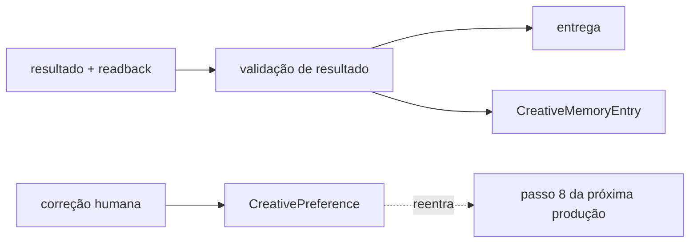

# Passo 12 — Revisão, entrega e memória criativa

**Responde:** o que foi produzido cumpre o que foi prometido, e o que o sistema
aprende com isso.

**Não responde:** o que produzir da próxima vez. Este passo produz **política**,
não direção — a direção continua nascendo no passo 8.

> **Estado: parcial.** `CreativePreference` está contratado, validado e com
> desempate de conflito implementado. Validação de resultado, entrega,
> `CreativeMemoryEntry` e métricas não existem.

## Lê e produz

| Lê | Produz |
|---|---|
| resultado + readback + plano aprovado | entrega validada, `CreativeMemoryEntry`, `CreativePreference` |

## É este passo que fecha o laço

Sem ele, cada produção começa do zero e o sistema não aprende — a correção que
uma pessoa fez hoje se perde e reaparece como o mesmo defeito no mês que vem.

## 1. Validação do resultado

O readback do passo 11 diz **o que saiu**. A validação diz se o que saiu cumpre
o que foi prometido. Os nove testes estão em
[áudio e verificação](../../../skills/cena-raiz/references/audio-verification.md):

dimensão · taxa de quadros · espaço de cor · faixa de cor · loudness · true
peak · voz na mixagem · buraco de imagem · legendas cabem

O teste de voz é o mais valioso e o menos óbvio: mede energia nos instantes em
que a transcrição diz que há palavra, contra a energia nas pausas. Delta medido
de 15,9 dB numa mixagem correta, 6,4 dB só com trilha, 1,2 dB com captions de
outra edição.

> Um teste que aponta a causa errada é pior que teste nenhum.

É o mesmo princípio dos validadores do pipeline: recusar dizendo **qual** campo
e **por quê**.

## 2. Entrega

Entregar é publicar. O que sai não volta atrás, e por isso a validação vem
antes — nunca "entrega e depois confere".

## 3. `CreativeMemoryEntry`

O registro do que aconteceu nesta produção: o plano aprovado, o que foi
executado, o resultado do readback, o que a revisão apontou.

Não existe ainda. Quando existir, é ele que permite perguntar "o que já
fizemos para esta marca que se parece com isto?" antes de gerar algo novo — a
regra *reutilizar antes de gerar* do passo 11 aplicada à produção inteira, não
só ao asset.

## 4. Correção humana vira `CreativePreference`

É a transformação mais delicada do sistema, e a que mais fácil se faz errado.

[`CreativePreference`](../../contracts/production/creative-preference.ts) **não
é memória de chat**. É escolha aprendida em revisão, com:

- **escopo** — `production` é o mais estreito; `brand`, o mais amplo;
- **polaridade** — `prefer`, `avoid` ou `require`;
- **origem** — aprovação, rejeição ou correção;
- **evidência** — a produção, a versão e o que a pessoa disse, preservado sem
  interpretação;
- **validade** e condição de substituição;
- **prioridade** e resolução explícita de conflito.

### A regra que justifica o contrato existir

**Uma correção feita numa produção não vira regra global sem aprovação
explícita.** Por isso `scope` é obrigatório e `production` não é o padrão
implícito — e por isso `provenance.approvedBy` existe: regra sem aprovador não
é correção aprovada.

Preferências entram no passo 8 como política adicional. Elas **não** alteram o
`BrandRuntimeProfile` em silêncio, não substituem o brief e não substituem a
evidência.

### Conflito

O desempate já está implementado em
[`validate-creative-preference.ts`](../../core/production/validate-creative-preference.ts):
**especificidade primeiro** — `production` vence `brand` — e só entre escopos
iguais a `priority` decide. `require` é mais forte que `prefer`.

A preferência derrotada é registrada, não descartada: `PlanInputs` guarda
`applied: false` com `losesTo`, porque "perdeu o conflito" e "ninguém
consultou" são estados diferentes e só o primeiro é auditável.

## 5. Métricas e evals

Falta definir. O que precisa ser verdade antes de existirem:

- diferença entre marcas precisa ser mensurável, não impressionista;
- uma regressão precisa ser atribuível a uma versão de planner, prompt ou perfil
  — é para isso que `PlanInputs.planner` existe;
- avaliação de resultado não pode virar preferência automática. Métrica é
  evidência; preferência exige aprovação humana.

## O que falta construir

1. Contrato e validador de validação de resultado.
2. `CreativeMemoryEntry` — contrato, validador e teste.
3. O caminho correção → `CreativePreference`, com o aprovador registrado.
4. Política de métricas e evals.
5. Teste de arquivo próprio para `CreativePreference` — hoje ela é testada
   dentro de `test-scene-plan.mjs`.

## Critérios de aceitação

- resultado inválido não é entregue;
- toda entrega registra o que foi verificado e com que valores;
- correção humana vira preferência somente com escopo e aprovador explícitos;
- preferência de uma produção não vira regra de marca sem aprovação;
- a memória permite reutilizar antes de gerar na produção seguinte.

## Conecta com

- **Passo 11** — [seleção e roteamento](passo-11-asset-selection-and-execution-routing.md):
  entrega o resultado e o readback.
- **Passo 8** — [`VideoAndMotionPlanner`](passo-8-video-and-motion-planner.md):
  recebe de volta as preferências aprovadas. É aqui que o laço se fecha.
- **Passo 6** — [`ContentAnalysis`](passo-6-content-analysis.md): a transcrição
  medida é o que torna o teste de voz possível.
